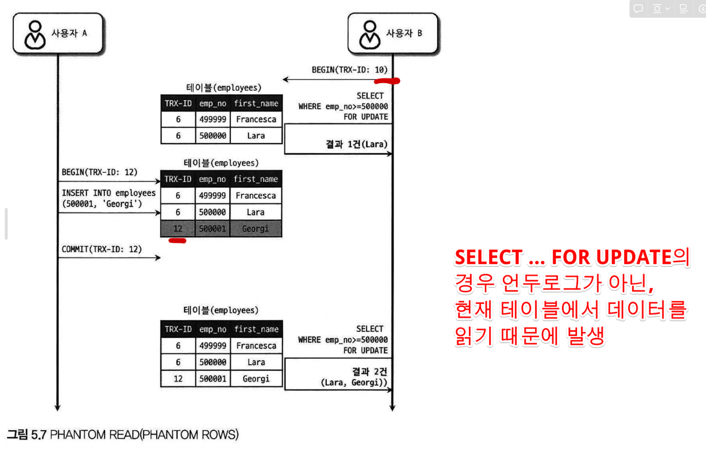

# Real MySQL 8.0 - 4장
MySQL 서버 구분

- MySQL 엔진(두뇌)
    - 사용자 접속, 쿼리 요청을 처리, SQL 파싱 및 옵티마이저 담당하는 부분
- 스토리지 엔진(손,발)
    - InnoDB, MyISAM, Memory 등이 있다.
    - 데이터를 실제로 어떻게 저장하고 읽어올지 담당하는 부분
    - 각 테이블 마다 다른 종류의 스토리지 엔진을 사용하는것이 가능하다.

## MySQL의 전체 구조


## 핸들러 API

MySQL 엔진에서 Inno DB와 같은 스토리지 엔진에 데이터 읽기, 쓰기 요청을 헨들러 요청이라고 한다.

따라서 MySQL 엔진의 쿼리 실행기에서 데이터를 쓰거나 읽고자 할때 MySQL 엔진과 스토리지 엔진 사이에 데이터를 주고 받기 위해  ‘핸들러 API’ 를 사용하여 주고 받는다.

---

# **MySQL의 스레딩 구조**

MySQL 서버는 멀티 프로세스 기반이 아니라 멀티 스레드 기반으로 작동한다. 그리고 크게 포그라운드 스레드와 백그라운드 스레드로 나뉠수 있다.

## MySQL의 포그라운드 스레드(=클라이언트 스레드, 사용자 스레드)

사용자의 요청을 처리하는 스레드

데이터를 읽는 작업을 처리한다. 디스크에 직접 데이터를 쓰는 작업은 백그라운드 스레드에서 일어남.

데이터 캐시나 버퍼에서 데이터를 읽어오며, 만약 캐시나 버퍼에 데이터가 없으면 디스크나 인덱스파일에 데이터를 직접 읽어와 처리하기도 한다.

현재 MySQL에 접속된 클라이언트의 수 만큼 포그라운드 스레드가 존재한다.

### MySQL의 백그라운드 스레드

디스크에 데이터를 직접 기록하는 작업은 백그라운드 스레드에서 일어난다.

현재 로그나, 버퍼풀에 있는 데이터를 디스크에 기록

기록 이외에 데이터를 버퍼로 읽어오거나, 락, 데드락 모니터하는 백그라운드 쓰레드도 존재한다.

### MySQL(InnoDB)이 스레드를 포그라운드, 백그라운드로 나뉜 이유?

읽기 요청의 처리와 쓰기 요청의 처리를 분리하기 위함.

사용자의 요청을 처리하는 도중 데이터의 쓰기 작업은 지연되어 처리될 수 있지만, 데이터의 읽기 작업은 절대 지연될 수 없기 때문이다.

---

## **MySQL이 사용하는 메모리 영역**

MySQL 에서 사용하는 메모리 영역은 크게 글로벌 메모리 영역과 로컬 메모리 영역으로 나뉜다.

### 글로벌 메모리 영역

MySQL 시작시 운영체제로 부터 할당받는 클라이언트 수와 무관하게 할당받는 모든 스레드가 공유하는 메모리 영역

버퍼, 캐시를 위해 사용된다.

대표적으로 InnoDB의 버퍼풀이 있다.

### 로컬 메모리 영역 (=세션 메모리 영역, 클라이언트 메모리 영역)

포워드 스레드(=클라이언트 스레드)가 사용자의 쿼리를 처리하기 위해 사용하는 메모리 공간

로컬 메모리 영역은 스레드별로 독립적으로 할당되며 절대 공유되지 않는다.

대표적으로 커넥션 버퍼나 정렬이나, 조인할때 사용하는 버퍼 등이 있다.

커넥션 버퍼나 결과 버퍼는 커넥션이 열려있는 동안 계속 메모리 공간에 남아있으며, 조인이나 정렬할때 사용되는 버퍼는 쿼리를 실행하는 순간에만 메모리공간에 할당 되었다가 해제된다.

---

# **플러그인 스토리지 엔진 모델**

### 플러그인

MySQL에서 기본적으로 제공되는 기능 이외에 부가적인 기능을 더 제공하기 위한 방법으로 플러그인 모델을 사용한다.

InnoDB 또한 플러그인 형태로 제공되는 하나의 스토리지 엔진에 해당한다.

스토리지 엔진 뿐만아니라 3장에서 살펴보았던, 사용자 인증을위한 Native Authentication, Caching SHA-2 Authentication과 같은 인증 모듈들도 전부 플러그인이다.

### 스토리지 엔진 확인 하기 - SHOW ENGINES


MySQL 서버에 포함되지 않은 스토리지 엔진을 사용하려면 MySQL 서버를 다시 빌드해야 한다. 하지만 플러그인 형태로 빌드된 스토리지 엔진 라이브러리를 다운로드해서 끼워넣기만 하면 손쉽게 사용할 수 있다.

### 플러그인 확인 하기 - SHOW PLUGINS;


스토리지 엔진 뿐만 아니라 인증이나 전문 검색 파서, 쿼리 재작성과 같은 기능을 플러그인 형태로 지원한다.

---

## 컴포넌트(MySQL 8.0부터)

MySQL 8.0부터 플러그인 아키텍처를 대체하기 위해 등장한 개념

플러그인 아키텍처의 단점

⇒ 플러그인들 끼리 통신이 안되고, 플러그인끼리의 상호 의존관계 설정이 안됨

⇒ 플러그인은 MySQL 서버의 변수나 함수를 직접 호출하기 때문에(캡슐화가 안되어있음) 안전하지 않음

---

## 쿼리 실행 구조

1. 사용자 요청

2. 쿼리 파서에서 쿼리 문장을 토큰으로 분리해 트리형태의 구조로 재구성⇒ 쿼리 문장의 기본 문법 오류 발견

3. 전처리기 ⇒ 쿼리 구조적 오류, 테이블, 컬럼이름 검증, 권한 검증

4. 옵티마이저 ⇒ 쿼리 문장을 저렴한 비용으로 가장 빠르게 처리할지 결정

5. 쿼리실행기 ⇒ 옵티마이저에서 만든 계획대로 핸들러에게 실제 요청을 주고받음

6. 스토리지엔진 ⇒ 실제 데이터를 디스크로부터 읽고 쓰는 작업을 수행

---

## 복제

**데이터를 “물리적으로 다른 서버의 저장 공간” 안에 동일한 데이터를 복사하는 기술**

---

## 쿼리 캐시

빠른 응답을 위해 SQL 실행 결과를 캐싱해두는 기능

캐시 저장결과가 실제 데이터와 달라지면 모두 삭제 해야하는 문제가 발생하고 이 과정에서 성능저하 유발

결과적으로, 8.0 부터 쿼리 캐시는 MySQL 서버의 기능에서 제거 됨

---

## 스레드 풀

내부적으로 사용자의 요청을 처리하는 스레드 개수를 줄여서 동시 처리되는 요청이 많다 하더라도 MySQL 서버의 CPU가 제한된 개수의 스레드 처리에만 집중할 수 있게 하여 서버의 자원 소모를 줄인다.

스레드 풀은 기본적으로 CPU 개수만큼 스레드 그룹을 생성하는데, 스레드 그룹의 개수는 thread_pool_size 시스템 변수를 변경해서 조정할 수 있다.

---

## 트랜잭션 지원 메타데이터

8.0 버전 부터는 ㄴ데이터베이스 서버에서 테이블의 구조정보 같은 메타데이터를  테이블에 모두 저장하도록 개선하여 기존의 파일 기반의 메타데이터 생성으로 인한 비정상 종료 시, 테이블이 깨지는 현상을 해결하였다.


---
# InnoDB 스토리지 엔진 아키텍처

InnoDB는 레코드 기반의 잠금을 제공하며, 그 때문에 높은 동시성 처리가 가능하고 안정적이다.

** 추가

**잠금의 종류:**

**공유 잠금 (Shared Lock): 여러 트랜잭션이 동시에 같은 레코드를 읽을 수 있지만, 해당 레코드를 수정할 수는 없습니다.**

**배타적 잠금 (Exclusive Lock): 한 트랜잭션이 레코드를 수정할 수 있으며, 다른 트랜잭션은 해당 레코드를 읽거나 수정할 수 없습니다.**

---

## 프라이머리 키에 의한 클러스터링

- InnoDB의 모든 테이블은 기본적으로 프라이머리키를 기준으로 저장된다.(프라이머리 키 값 순서대로 저장)
- 세컨더리 인덱스는 레코드의 주소 대신 프라이머리 키의 값을 논리적인 주소로 사용한다 (**세컨더리 인덱스 → 프라이머리 키 → 레코드 주소 값)**

> **세컨더리 인덱스는 특정 컬럼 값에 대한 프라이머리 키를 저장하고, 이 프라이머리 키를 통해 실제 레코드의 주소에 접근하는 구조**
>

****

- InnoDB에서는 모든 데이터는 프라이머리 키를 기준으로 정렬된 형태로 저장되어 있기 때문에 **인덱스 레인지 스캔**을 활용하면 데이터를 빨리 읽을 수 있다.
- MyISAM은 클러스터링 키를 지원하지 않기 프라이머리키와 세컨더리 인덱스 구분이 없고 모든 인덱스는 실제 데이터의 물리적인 주소값을 갖는다.

클러스터링

> 비슷한 데이터끼리 묶어서 보관하는것
>

세컨더리 인덱스

> 클러스터링 인덱스(PK 인덱스)를 제외한 모든 인덱스
>

---

## 외래 키 지원

외래 키의 경우 InnoDB 스토리지 엔진 레벨에서 지원하는 기능으로, MyISAM이나 MEMORY 스토리지엔진에서는 지원하지 않는 기능이다.

외래키 유의사항

외래 키 사용시, 부모 테이블과 자식 테이블 모두 인덱스를 생성해야 하고 변경 시, 여러 테이블에 잠금이 전파되는 문제와 데드락이 발생할때가 많아서 유의해야 한다.

### 외래 키 체크 기능 끄기

외래키가 복잡하게 얽혀있는 경우 데이터를 적재하거나 스키마 변경등의 관리 작업이 실패할 수 있다.

만약, 급하게 데이터를 처리해야 하는 경우 다음과 같이 외래 키 체크 기능을 끌 수 있다.

```vbnet
SET foreign_key_checks=OFF;

```

왜래 키 체크 키능을 끄고 작업을 수행 한 후 일관성이 맞춰졌다면, 다시 체크 기능을 켜주어야 한다.

```vbnet
SET foreign_key_checks=ON;

```

---

## MVCC(MultiVersion Concurrency Control)

> 하나의 레코드에 대해 여러개의 버전이 유지되고, 필요에 따라 어느 데이터가 보여지는지 여러 가지 상황에 따라 달라지는 구조
>

InnoDB는 언두 로그(Undo log) 를 이용해 이 기능을 구현한다.


1. member 테이블 생성
2. INSERT 문을 이용해 member 삽입
  1. InnoDB 버퍼 및 디스크에 데이터 존재 , undo 로그 x
3. UPDATE 문을 이용해 area 를 ‘서울’로 수정(그림)
  1. InnoDB의 버퍼 풀은 새로운 값인 ‘서울’로 업데이트 된다.
  2. undo 로그에 기존의 area 인 ‘경기’를 가지고 있는다
4. SELECT 문을 이용해 변경된 데이터를 조회 해보면 어떤 어떻게 될까?

> MySQL 서버의 시스템 변수에 설정된 격리 수준(transaction_isolation)에 따라 다르다!
>

격리 수준

Isolation Level은 `READ UNCOMMITTED`, `READ COMMITTED`, `REPEATABLE READ`, `SERIALIZABLE`이 존재하며 갈수록 동시성(성능)이 낮아지지만 독립성과 정합성이 높아질 수 있다.

```jsx
READ_UNCOMMITED ⇒ 락이 걸려있어도 아직 커밋되지 않은 데이터도 읽겠다.
READ_COMMITED ⇒ 락이 걸려있어도 이전 커밋된 상태 까지의 데이터만 읽겠다.
REPEATABLE_READ ⇒ 자신보다 이전 트랜잭션ID 에서 변경까지만 읽겠다. Inno DB의 기본값
SERIALIZABLE ⇒ 락이 걸려있으면 락이 회수 될때까지 기다렸다가 읽겠다.
```

READ_COMMITTED , REPEATABLE_READ(Default), SERIALIZABLE 인 경우에는 커밋이나 롤백중에 데이터를 조회하게 되면 언두 영역의 데이터를 반환 한다.

---

### 잠금 없는 일관된 읽기( Non-Locking Consistent Read)


InnoDB 스토리지 엔진은 MVCC 기술을 이용해 잠금을 걸지 않고 읽기 작업을 수행한다.

특정 사용자가 레코드를 변경하고 아직 커밋을 수행하지 않았다 하더라고 Undo 로그를 사용하여 변경 되기 전의 데이터를 읽어 잠금 없이 읽기가 가능하다.

---

## 자동 데드락 감지

InnoDB 스토리지 엔진은 내부적으로 교착 상태에 빠지지 않았는지 체크하기 위해 목록(Wait-for list)을 관리한다

데드락에 걸린 트랜잭션 중 어느 트랜잭션을 먼저 종료할지는 언두 로그를 더 적게 가져 부하가 적은 트랜잭션을 선택하여 강제 종료한다.

동시 처리 스레드가 매우 많을 경우 데드락 감지 스레드는 더 많은 CPU 자원을 소모하게 된다. 따라서

innodb_deadloct_detect 시스템변수를 off 하여 데드락 감지를 종료하고 timeout 을 통해 에러메시지를 반환하도록 하여 해결할 수 있다.

---

## 자동화된 장애 복구

MySQL이 갑자기 종료되어 완료되지 못한 트랜잭션이나 디스크에 일부만 써진 데이터(Partial Write)가 존재한다면 InnoDB 는 서버를 재시작 할 때 이러한 부분을 자동으로 복구한다.

### 자동화된 장애 복구가 안될 경우

디스크나 서버 하드웨어 이슈로 서버를 재시작 할**때 자동화된 복구가 수행되지 않을 수 있다.** 이 경우 자동복구를 멈추고 MySQL 서버는 종료되어 버린다.

이때는 **innodb_force_recovery 시스템 변수를 설정한 후 MySQL 서버를 재시작** 해야한다.

- 로그 파일이 손상 되었을 경우, innodb_force_recovery를 6으로 설정 후 재시작
- 테이블 데이터 파일이 손상 되었을 경우, innodb_force_recovery를 1로 설정 후 재시작
- 어떤 부분이 손상되었는지 모를 경우에는 1부터 6까지 변경하면서 재시작
  - innodb_force_recovery 값이 커질수록 심각한 상황
- 그래도 재시작 되지 않으면, 백업을 이용해 DB를 다시 구축해야 한다.

---

## InnoDB 버퍼 풀

InnoDB 스토리지 엔진에서 가장 핵심적인 부분

디스크 데이터 파일이나 인덱스 정보를 메모리에 캐시해두는 공간

쓰기 작업을 일괄처리 할수 있는 버퍼 역할도 한다. ⇒ INSERT, UPDATE, DELETE 와 같은 쓰기 작업을 모아서처리

### 버퍼 풀의 크기 설정

처음으로 MySQL 서버를 준비한다면,

보통 처음에 운영체제의 전체 메모리의 50% 정도에서 시작해서 올려나가면서 최적점을 찾는다.

버퍼 풀의 크기는 innodb_buffer_pool_size 시스템 변수로 변경할 수 있고, MySQL 서버가 한가한 시점에 작업을 진행하는것이 좋다.

### 버퍼 풀의 구조

InnoDB 스토리지 엔진은 버퍼 풀이라는 거대한 메모리 공간을 페이지 크기(innodb_page_size 시스템 변수의 설정된 크기) 조각으로 쪼개어 데이터를 필요로 할 때 해당 데이터 페이지를 읽어서 각 조각에 저장한다.

버퍼 풀은 페이지 조각을 관리하기 위해 다음과 같이 3개의 자료구조를 관리한다.

- LRU(Least Recently Used) 리스트 - 가장 오랫동안 사용되지 않은 페이지가 먼저 교체됨


각 페이지는 얼마나 최근에 접근했는지에 따라 Age 값이 부여됨.

새로운 페이지는 Old 리스트의 헤드 부분(5/8 지점)에 추가

한번 읽힌 페이지는 Age가 초기화 되고 New 리스트 의 헤드쪽으로 이동(MRU - Most Recently Used)

사용하지 않는 페이지는 Old 리스트의 꼬리쪽으로 이동(LRU)

- 플러시 리스트

디스크로 동기화되지 않은 데이터를 가진 데이터 페이지(더티 페이지)의 변경 시점 기준의 페이지 목록을 관리한다.

일단 한번 변경이 일어난 데이터 페이지는 플러시 리스트에 관리되고 특정 시점이 되면 디스크로 기록해야 한다.

- 프리 리스트

InnoDB 버퍼 풀에서 실제 사용자 데이터로 채워지지 않은 비어 있는 페이지의 목록

---
# Real MySQL 8.0 - 5장

# 5. 트랜잭션과 잠금

트랜잭션 : 논리적인 작업 셋을 모두 완벽하게 처리하거나, 처리하지 못할 경우에는 원 상태로 복구해서 작업의 일부만 적용되는 현상이 발생하지 않도록 해주는 기능

잠금 : 여러 커넥션에서 동시에 동일한 자원을 요청할 경우 순서대로 한 시점에는 하나의 커넥션만 변경할 수 있게 해주는 역할을 한다.

### MySQL 에서의 트랜잭션

- InnoDB

```jsx
CREATE TABLE tab_innodb ( fdpk INT NOT NULL, PRIMARY KEY(fdpk) ) ENGINE=INNODB;
INSERT INTO tab_innodb (fdpk) VALUES (3);

SET autocommit=ON;

INSERT INTO tab_innodb (fdpk) VALUES (1),(2),(3);

SELECT * FROM tab_innodb;
```

결과:


- MyISAM

```jsx
CREATE TABLE tab_myisam ( fdpk INT NOT NULL, PRIMARY KEY(fdpk) ) ENGINE=MyISAM;
INSERT INTO tab_myisam (fdpk) VALUES (3);

SET autocommit=ON;

INSERT INTO tab_myisam (fdpk) VALUES (1),(2),(3);

SELECT * FROM tab_myisam;

```

결과:


> InnoDB 엔진에서는 트랜잭션이 적용되었기 때문에 중복되는 pk 값을 넣었을때 롤백되는 반면, MyISAM 에서는 트랜잭션이 적용되지 않기 때문에 1,2 데이터 값이 들어간 뒤에 3 중복 값이 들어갈때 에러처리가 나고 데이터는 테이블에 그대로 남은채로 있다.
>

### 5.1.2 주의 사항

꼭 필요한 최소의 코드에만 적용하는 것이 좋다.

DBMS의 트랜잭션 처리에 좋지 않은 영향을 미치는 부분에 대해 알아보기 위해 다음과 같이 서버에서 처리한다고 가정해 보자

1) 처리 시작

⇒ 데이터베이스 커넥션 생성

⇒ 트랜잭션 시작

2) 사용자의 로그인 여부 확인

3) 사용자의 글쓰기 내용의 오류 여부 확인

4) 첨부로 업로드된 파일 확인 및 저장

5) 사용자의 입력 내용을 DBMS에 저장

6) 첨부 파일 정보를 DBMS에 저장

7) 저장된 내용 또는 기타 정보를 DBMS 에서 조회

8) 게시물 등록에 대한 알림 메일 발송

9) 알림 메일 발송 이력을 DBMS에 저장

⇒ 트랜잭션 종료

⇒ 데이터 베이스 커넥션 반납

10) 처리 완료

- 2,3,4와 같은 절차도 하나의 트랜잭션안에서 처리하기 때문에 커넥션을 오래토록 소유하고 있어 여유 커넥션의 개수가 줄어드는 현상이 발생한다.
- 8번 알림 작업의 경우 네트워크를 통해 원격 서버와 통신하는 과정은 트랜잭션 내에서 제거하는 것이 좋다.
- 5,6번 작업은 하나의 트랜잭션으로 묶고 7번 작업은 단순 조회 이므로 트랜잭션에 포함시킬 필요가 없다. 따라서 이런식으로 별도의 트랜잭션으로 분리하여 처리하는 것이 좋다.

문제를 해결하고 다시 설계를 해보자.

1) 처리 시작

2) 사용자의 로그인 여부 확인

3) 사용자의 글쓰기 내용의 오류 여부 확인

4) 첨부로 업로드된 파일 확인 및 저장

⇒ 데이터 베이스 커넥션 생성

⇒ 트랜잭션 시작

5) 사용자의 입력 내용을 DBMS에 저장

6) 첨부 파일 정보를 DBMS에 저장

⇒ 트랜잭션 종료

7) 저장된 내용 또는 기타 정보를 DBMS 에서 조회

8) 게시물 등록에 대한 알림 메일 발송

⇒ 트랜잭션 시작

9) 알림 메일 발송 이력을 DBMS에 저장

⇒ 트랜잭션 종료

⇒ 데이터 베이스 커넥션 반납

10) 처리 완료

### MySQL 엔진의 잠금

### 글로벌 락

한 세션에서 글로벌 락을 획득하면 다른 세션에서 SELECT를 제외한 대부분의 DDL 문장이나 DML 문장을 실행 하는 경우 글로벌 락이 해제될때까지 해당 문장이 대기 상태로 남는다.

글로벌 락이 영향을 미치는 범위는 MySQL 서버 전체이기 때문에, 테이블이나 데이터베이스가 다르더라도 영향을 받는다.

글로벌 락은 전체 MySQL 서버에 큰 영향을 미치기 때문에 웹 **서비스용으로 사용되는 MySQL 서버에서는 가급적 사용하지 않는 것이 좋다.**

MySQL 8.0 버전 부터는 조금 더 가벼운 글로벌락인, 백업 락이 도입되었다.

일반적인 MySQL 서버 구성은 소스 서버(Source server)와 레플리카 서버(Replica server)로 구성되는데, 보통 백업 작업의 경우 레플리카 서버에서 실행한다. 정상적으로 복제는 실행되지만 백업의 실패를 막기 위해 DDL 명령이 실행되면 복제를 일시 중지하는 역할을 한다.


### 테이블 락

개별 테이블 단위로 설정 되는 잠금

```jsx
// 테이블 락 획득
LOCK TABLES table_name [ READ | WRITE ];

// 테이블 락 반납
UNLOCK TABLES;
```

특별한 상황이 아니면 애플리케이션에서 사용할 필요가 거의 없다. 명시적으로 테이블을 잠그는 작업은 글로벌 락과 동일하게 온라인 작업에 상당한 영향을 미치기 때문이다.

### 네임드 락

GET_LOCK() 함수를 이용해 사용자가 지정한 문자열에 대해 잠금을 설정 할 수 있다.

네임드 락은 자주 사용되지는 않지만, 데이터베이스 서버 1대에 5대의 웹서버가 접속해서 서비스 해야 하는 상황에서 배치 프로그램 처럼 한꺼번에 많은 레코드를 변경하는 경우에 사용될 수 있다.

```

// 네임드락 획득 : 2초간 mylock이라는 락을 생성 - 성공 일 경우 1을 반환, 아닐 경우 0 이나 NULL 반환
SELECT GET_LOCK('mylock', 2); 

// 네임드락 상태 확인
SELECT IS_FREE_LOCK('mylock');

// 네임드락 반환
SELECT RELEASE_LOCK('mylock');

SELECT GET_LOCK('mylock1', 10);

// -> 여기에서 mylock1에 대한 작업들 수행

SELECT GET_LOCK('mylock2', 10);

// -> 여기에서는 mylock2에 대한 작업들 수행

SELECT RELEASE_LOCK('mylock2'); // mylock2 반납
SELECT RELEASE_LOCK('mylock1'); // mylock1 반납

혹은

SELECT RELEASE_ALL_LOCKS(); // 전체 네임드락 반납
```

### 메타데이터 락

테이블이나 뷰의 이름, 구조 등을 변경 하는 경우에 자동으로 획득 하는 잠금

RENAME TABLE로 테이블 이름을 변경 하는 경우, 원본 이름과 변경될 이름 두개 모두 한꺼번에 잠금을 설정한다.

임시로 사용하던 테이블을 실제 운영 테이블로 사용하려는 경우, 아래와 같이 RENAME TABLE 명령 2개를 사용하면 아주 짧은 시간이지만 rank 테이블이 존재하지 않는 순간이 생기게 되고 그때 Table not found 오류가 발생 될 수 있다.

```
RENAME TABLE rank to rank_backup;
RENAME TABLE rank_new to rank;
```

**로그 테이블 구조 변경 하기 : 테이블 락과 메타데이터 락을 함께 사용하는 케이스**

***1. DDL로 구조 변경하기***

DDL은 단일 스레드로 작동하기 때문에 상당히 많은 시간이 소요 될 수 있다. 시간이 너무 오래 걸리는 경우 언두 로그도 함께 증가하게 되고 이에 따라 MySQL 서버의 성능이 저하 될 수 있다.

***2. 새로운 구조의 임시 테이블 만들어서 복사하는 방법***

새로운 구조의 임시 테이블 생성하고 최근 데이터까지는 PK 범위별로 나누어 멀티 쓰레드로 빠르게 복사한다.

나머지 데이터는 테이블에 락을 걸고 복사 작업 수행, 복사 작업 수행 후 임시 테이블을 실제 운용 테이블로 이름 바꾼다.

### **InnoDB 스토리지 엔진의 잠금**

InnoDB 스토리지 엔진에서는 레코드 기반의 잠금 기능을 제공하며,

잠금 정보가 상당히 적은 공간으로 관리되는 레코드 기반의 잠금 기능을 제공하기 때문에 레코드락이 페이지락, 테이블 락으로 레벨업 되는 락 에스컬레이션이 없다.


### 레코드 락

레코드 자체만을 잠그는 것

InnoDB 스토리지 엔진은 레코드 자체가 아니라 사실은 인덱스의 레코드를 잠근다.

인덱스가 하나도 없는 테이블이라도 내부적으로는 클러스터 인덱스를 생성해 가지고 있기 때문에 그 클러스터 인덱스를 이용해 잠금을 설정한다.

### 갭 락

레코드 자체가 아닌 레코드 바로 인접한 레코드 사이의 간격만을 잠그는 것을 의미한다.

레코드와 레코드 사이의 새로운 레코드가 생성되는 것을 제어한다.

### 넥스트 키 락

레코드 락 + 갭 락

바이너리 로그에 기록되는 쿼리가 레플리카 서버에서 실행될 때 소스 서버에서 만들어 낸 결과와 동일한 결과를 만들어내도록 보장하는 것이 주 목적이다.

### 자동 증가 락

AUTO_INCREMENT 칼럼이 사용 된 테이블에 동시에 여러 레코드가 INSERT 되는 경우, 저장되는 각 레코드는 중복되지 않고 저장된 순서대로 증가하는 일련번호 값을 가져야 한다. 이를 위해 InnoDB 에서는 내부적으로 AUTO_INCREMENT 락이라고 하는 테이블 수준의 잠금을 사용한다.

innodb_autonic_lock_mode

0:모든 INSERT 문장에 자동증가 락

1: 레코드 건수를 정확이 예측할 수 있을때는 자동증가 락 X , 레코드 건수를 예측할 수 없을때는 자동증가 락 사용

2: 경량화된 래치(뮤텍스)를 사용, 연속된 자동 증가 값 보장 X

MySQL 8.0 부터는 바이너리 로그 포맷이 ROW 포맷이기 때문에 기본값이 2로 변경

추가)

바이너리 로그 포맷 방식

> **Statement-based** (--binlog-format=STATEMENT)
>
- 데이터 변경 작업을 수행하는 SQL 쿼리문을 바이너리 로그에 저장한다.
- Replication시 복제본 서버는 원본 서버의 바이너리 로그를 읽어들여 그 안에 기록된 SQL 문장들을 순서대로 재실행하여 Replication을 수행한다.
- SQL 쿼리문을 바이너리 로그에 저장하므로 감사에 용이하다.
- 트랜잭션 격리수준이 Repeatable Read 이상이어야 한다.

> **Row-based** (--binlog-format=ROW (기본값))
>
- 바이너리 로그에서 개별 테이블 행이 어떻게 영향을 받는지를 로그에 기록한다.
- Replication시 SQL 문장을 해석하거나 재실행하는 것이 아니라, 단순히 특정 레코드의 변경 사항을 적용하여 Replication을 수행한다.

### 인덱스와 잠금

InnoDB의 잠금은 레코드가 아닌 인덱스를 잠그는 방식으로 처리, 즉 변경해야 할 레코드를 찾기 위해 검색한 인덱스의 레코드를 모두 락을 걸어야 한다.

업데이트 시 Where 절에 있는 컬럼 중 인덱스를 가지고 있는 컬럼의 인덱스 자체에 락을 걸어버리기 때문에 **레코드 1개를 업데이트 하는 경우라도, 여러 레코드에 잠금**이 걸릴 수 있다.

first_name 에만 인덱스가 지정되어 있는 employees 테이블에서 다음과 같이 하나의 row를 업데이트 하는 상황을 예를 들어보면

```sql
SELECT COUNT(*)FROM employeesWHERE first_name='Georgi'AND last_name='Klassen';

```

first_name='Georgi' AND last_name='Klassen' 인 하나의 row만 업데이트를 함에도 불구하고, InnoDB는 first_name 인덱스 자체에 락을 걸기 때문에, 인덱스 테이블 상에 first_name='Georgi' 인 모든 레코드에 락을 걸어버린다.

업데이트 시, 위와 같이 적절히 인덱스가 설정 되어있지 않으면 이렇게 잠금의 범위가 커져서 동시성이 상당히 떨어 질 수 있다.

### 그러면 테이블에 인덱스가 하나도 없다면?

테이블을 풀스캔 하면서 UPDATE 작업을 하는데, 이 과정에서 **테이블에 있는 모든 레코드를 잠궈**버리게 된다.

그래서 UPDATE 와 같이 잠금이 걸리는 작업 같은 경우, **잠금의 범위를 최소화 하도록 인덱스 설계**를 잘 하는것이 중요하다.

### MySQL의 격리 수준

**트랜잭션의 격리 수준(isolation level)이란** 여러 트랜잭션이 동시에 처리될 때 특정 트랜잭션이 다른 트랜잭션에서 변경하거나 조회중인 데이터를 볼수있게 할지, 못보게 할지를 결정하는 것


아래로 갈수록 격리 수준이 높아지고, 동시 처리 성능이 떨어진다.

오라클 같은 DBMS에서는 주로 READ COMMITTED 수준을 많이 사용하며, MySQL에서는 REPEATABLE READ 수준을 많이 사용한다.

### READ UNCOMMITTED


각 트랜잭션에서의 변경 내용이 아직 COMMIT이나 ROLLBACK 되지 않은 상태에서도 다른 트랜잭션에서 조회가 가능한 격리수준.

> Dirty Read
>

어떠한 트랜잭션에서 처리한 작업이 아직 완료 되지 않았는데도 다른 트랜잭션에서 볼수 있는 현상을 더티 리드(Dirty Read)라고 한다.

Dirty Read 문제가 발생하기 때문에 조회 할때마다 조회 데이터가 실제 DB에 있는 데이터와 결과가 다르거나 사라지는 문제가 생길 수 있다.

READ UNCOMMITED의 경우 RDBMS 표준에서 트랜잭션의 격리수준으로 인정하지 않을 정도로 정합성에 많은 문제가 있다.

### **READ COMMITED**


오라클 DBMS에서 기본으로 사용되는 격리수준

온라인 서비스에서 가장 많이 사용되는 격리수준이다.

새로운 변경사항이 들어오면, 이전 데이터는 언두로그에 기록되고 변경사항이 커밋 되기 전 까지 다른 트랜잭션에서의 요청에 언두로그에 있는 이전 데이터를 데이터를 반환한다.

> NON-REPEATABLE READ 정합성 문제
>

하나의 트랜잭션 안에서 여러번의 똑같은 SELECT 쿼리로 데이터를 요청했을 때, 항상 같은 결과를 가져와야한다는 REPEATABLE READ 정합성에 어긋날 경우 → NON-REPEATABLE READ 문제라고 한다.

중간에 다른 트랜잭션에서 커밋한 데이터 때문에 한 트랜잭션 안에서 같은 SELECT문의 실행 결과가 달라지는 문제 발생

금전적인 문제를 다루는 경우 문제가 될 수 있다.

오늘 입금된 금액의 총합을 조회하는 상황에서 NON-REPEATABLE READ 문제가 발생 할 경우,

총합을 계산하는 SELECT 쿼리가 실행 될 때 마다 다른 결과를 가져올 수 있기 때문이다.

### REPEATABLE READ

InnoDB에서 기본으로 사용되는 격리 수준

트랜잭션 Id 를 기준으로 **자신보다 이후에 발생한 트랜잭션에서의 변경사항은 읽지 않는다.**

트랜잭션 ID(순차적으로 증가하는 값)를 사용한다.


사용자 B의 트랜잭션(10번) 이 실행되는 도중 사용자 A의 트랜잭션(12번)에서 데이터의 변경이 일어났다. REPEATABLE READ에서는 트랜잭션 번호가 보다 작은 트랜잭션 번호에서 변경된 것만 보이기 때문에,

사용자 B의 트랜잭션 이후에 BEGIN 된 사용자 A의 COMMIT내용을 읽지 않고, 언두로그에 기록된 데이터를 대신 읽는다.

> PHANTOM READ 문제
>

트랜잭션에서 수행한 변경 작업에 의해 레코드가 보였다 안 보였다 하는 현상을 말한다.



똑같은 SELECT 쿼리를 수행했지만 서로 다른 결과가 나타나는 부정합 발생

### **SERIALIZABLE**

InnoDB에서의 순수한 SELECT 읽기 작업의 경우 잠금이 필요없는 일관된 읽기를 지원하기 때문에 아무런 레코드 잠금도 없이 실행된다.

하지만 트랜잭션의 격리수준을 SERIALIZABLE로 설정하게 되면 읽기 작업도 잠그게 되고, 다른 트랜잭션에서 읽기 작업을 수행하기 위해서는 다른 트랜잭션의 작업이 완료 되어 잠금을 반환 할때까지 기다려야한다.

PHANTOM READ 문제가 발생하지 않는다는 장점이 있지만, InnoDB에서는 레코드 기반의 갭락과 넥스트 키 락 덕분에 REPEATABLE READ 격리 수준에서도 이미 PHANTOM READ 문제가 발생하지 않기 때문에 굳이 동시처리 성능이 떨어지는 SERIALIZABLE 로 격리 수준을 설정 할 필요성이 없다.


---
# 6. 데이터 압축

데이터 파일이 클수록 쿼리를 처리하기 위해 더 많은 데이터페이지를 버퍼 풀로 읽어야하고,

백업 시간이 오래걸리며, 복구하는 데도 그만큼의 시간이 걸린다.

따라서 이런 문제점을 해결하기 위해 데이터 압축 기능을 제공한다.

### 페이지 압축

MySQL 서버가 디스크에 저장하는 시점에 데이터 페이지가 압축되어 저장되고, 반대로 MySQL. 서버가 디스크에서 데이터 페이지를 읽어올 때 압축이 해제된다.

문제점: 

하나의 테이블은 동일한 크기의 페이지로 통일돼야 한다.

따라서 페이지 압축 기능은 운영체제별로 특정 버전의 파일 시스템에만 지원되는 펀치 홀 이라는 기능을 사용한다.

### 테이블 압축

운영체제나 하드웨어에 대한 제약 없이 사용할 수 있기 때문에 일반적으로 더 활용도가 높은 편이다.

단점:

- 버퍼 풀 공간 활용률이 낮음
- 쿼리 처리 성능이 낮음
- 빈번한 데이터 변경시 압축률이 떨어짐

### 압축 테이블 생성

```jsx
SET GLOBAL innodb_file_per_table=ON;   //테이블 시스템 변수 설정

CREATE TABLE compressed_table( 
	c1 INT PRIMARY KEY
	)
	ROW_FORMAT=COMPRESSED  //옵션 명시
	KEY_BLOCK_SIZE=8;    //페이지의 목표 크기를 명시
```

테이블 압축 방식에서 가장 중요한 것은 원본 데이터 페이지의 압축 결과가 목표 크기 보다 작거나 같을 때까지 반복해서 페이지를 스플릿한다.

### KEY_BLOCK_SIZE 결정

압축된 결과가 어느 정도가 될지를 예측해서 KEY_BLOCK_SIZE 를 결정하는 것이 중요하다.

따라서 테이블 압축을 적용하기 전에 먼저 4KB 또는 8KB로 테이블을 생성해서 샘플 데이터를 저장해보고 적절한지 판단해야한다.

### 압축된 페이지의 버퍼 풀 적재 및 사용

InnoDB 는 압축된 테이블의 데이터 페이지를 버퍼 풀에 적재하면 압축된 상태와 압축이 해제된 상태 2개 버전을 관리

따라서 버퍼 풀의 공간을 이중으로 사용하여 메모리를 낭비하게 됨

이 문제를 해결하기 위해 Unzip_LRU 리스트를 별도 관리

버퍼 풀 공간이 필요한 경우 압축된 데이터 페이지는 유지하고 Unzip_LRU 리스트에서 압축 해제된 버전은 제거하여 버퍼 풀 공간 확보

압축된 데이터 페이지가 자주 사용되는 경우에는 Unzip_LRU 리스트에 압축 해제된 페이지를 계속 유지하여 압축 및 압축 해제 작업 최소화

압축된 페이지가 사용되지 않을 경우 LRU 리스트에서 제거