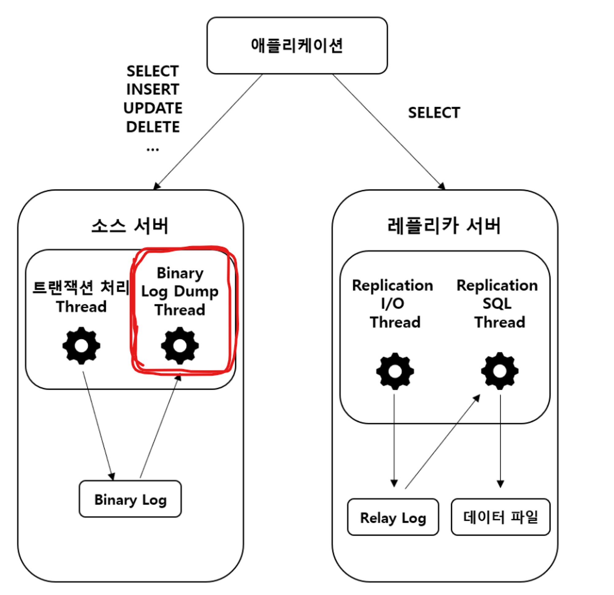
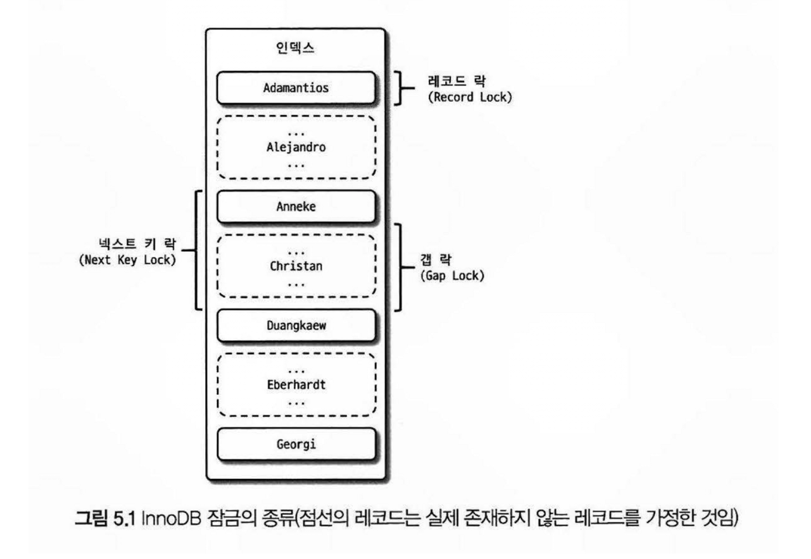
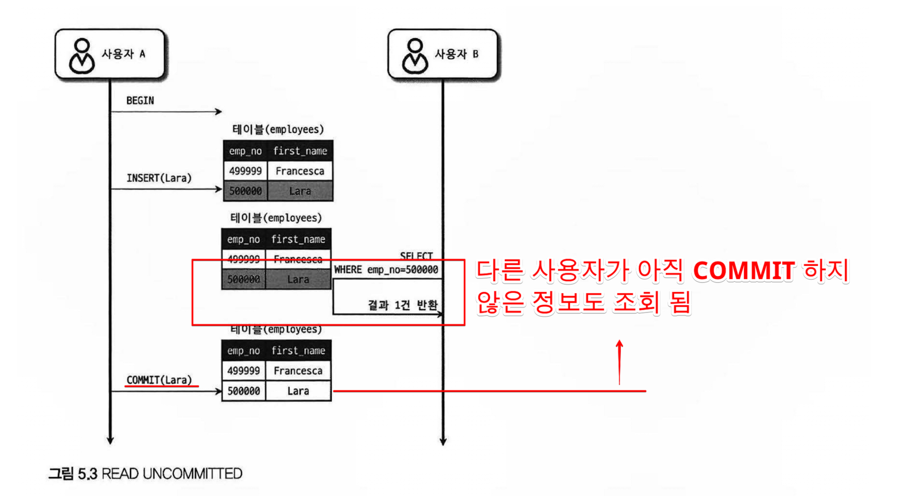
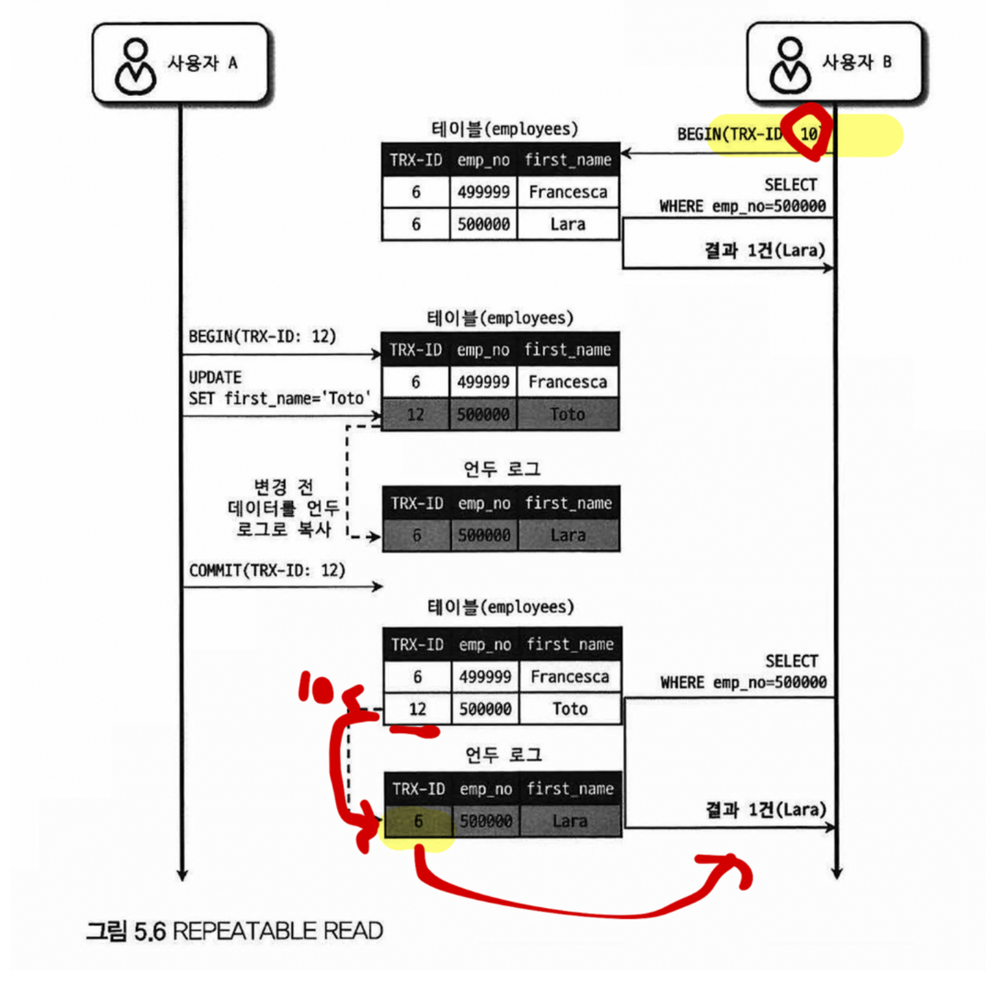

# Real MySQL 8.0 - 5장

## 5.트랜잭션과 잠금

트랜잭션 : 논리적인 작업 셋을 모두 완벽하게 처리하거나, 처리하지 못할 경우에는 원 상태로 복구해서 작업의 일부만 적용되는 현상이 발생하지 않도록 해주는 기능

잠금 : 여러 커넥션에서 동시에 동일한 자원을 요청할 경우 순서대로 한 시점에는 하나의 커넥션만 변경할 수 있게 해주는 역할을 한다.

### MySQL 에서의 트랜잭션

- InnoDB

```jsx
CREATE TABLE tab_innodb ( fdpk INT NOT NULL, PRIMARY KEY(fdpk) ) ENGINE=INNODB;
INSERT INTO tab_innodb (fdpk) VALUES (3);

SET autocommit=ON;

INSERT INTO tab_innodb (fdpk) VALUES (1),(2),(3);

SELECT * FROM tab_innodb;
```

결과:


- MyISAM

```jsx
CREATE TABLE tab_myisam ( fdpk INT NOT NULL, PRIMARY KEY(fdpk) ) ENGINE=MyISAM;
INSERT INTO tab_myisam (fdpk) VALUES (3);

SET autocommit=ON;

INSERT INTO tab_myisam (fdpk) VALUES (1),(2),(3);

SELECT * FROM tab_myisam;

```

결과:


> InnoDB 엔진에서는 트랜잭션이 적용되었기 때문에 중복되는 pk 값을 넣었을때 롤백되는 반면, MyISAM 에서는 트랜잭션이 적용되지 않기 때문에 1,2 데이터 값이 들어간 뒤에 3 중복 값이 들어갈때 에러처리가 나고 데이터는 테이블에 그대로 남은채로 있다.
>

### 5.1.2 주의 사항

꼭 필요한 최소의 코드에만 적용하는 것이 좋다.

DBMS의 트랜잭션 처리에 좋지 않은 영향을 미치는 부분에 대해 알아보기 위해 다음과 같이 서버에서 처리한다고 가정해 보자

1) 처리 시작

⇒ 데이터베이스 커넥션 생성

⇒ 트랜잭션 시작

2) 사용자의 로그인 여부 확인

3) 사용자의 글쓰기 내용의 오류 여부 확인

4) 첨부로 업로드된 파일 확인 및 저장

5) 사용자의 입력 내용을 DBMS에 저장

6) 첨부 파일 정보를 DBMS에 저장

7) 저장된 내용 또는 기타 정보를 DBMS 에서 조회

8) 게시물 등록에 대한 알림 메일 발송

9) 알림 메일 발송 이력을 DBMS에 저장

⇒ 트랜잭션 종료

⇒ 데이터 베이스 커넥션 반납

10) 처리 완료

- 2,3,4와 같은 절차도 하나의 트랜잭션안에서 처리하기 때문에 커넥션을 오래토록 소유하고 있어 여유 커넥션의 개수가 줄어드는 현상이 발생한다.
- 8번 알림 작업의 경우 네트워크를 통해 원격 서버와 통신하는 과정은 트랜잭션 내에서 제거하는 것이 좋다.
- 5,6번 작업은 하나의 트랜잭션으로 묶고 7번 작업은 단순 조회 이므로 트랜잭션에 포함시킬 필요가 없다. 따라서 이런식으로 별도의 트랜잭션으로 분리하여 처리하는 것이 좋다.

문제를 해결하고 다시 설계를 해보자.

1) 처리 시작

2) 사용자의 로그인 여부 확인

3) 사용자의 글쓰기 내용의 오류 여부 확인

4) 첨부로 업로드된 파일 확인 및 저장

⇒ 데이터 베이스 커넥션 생성

⇒ 트랜잭션 시작

5) 사용자의 입력 내용을 DBMS에 저장

6) 첨부 파일 정보를 DBMS에 저장

⇒ 트랜잭션 종료

7) 저장된 내용 또는 기타 정보를 DBMS 에서 조회

8) 게시물 등록에 대한 알림 메일 발송

⇒ 트랜잭션 시작

9) 알림 메일 발송 이력을 DBMS에 저장

⇒ 트랜잭션 종료

⇒ 데이터 베이스 커넥션 반납

10) 처리 완료

### MySQL 엔진의 잠금

### 글로벌 락

한 세션에서 글로벌 락을 획득하면 다른 세션에서 SELECT를 제외한 대부분의 DDL 문장이나 DML 문장을 실행 하는 경우 글로벌 락이 해제될때까지 해당 문장이 대기 상태로 남는다.

글로벌 락이 영향을 미치는 범위는 MySQL 서버 전체이기 때문에, 테이블이나 데이터베이스가 다르더라도 영향을 받는다.

글로벌 락은 전체 MySQL 서버에 큰 영향을 미치기 때문에 웹 **서비스용으로 사용되는 MySQL 서버에서는 가급적 사용하지 않는 것이 좋다.**

MySQL 8.0 버전 부터는 조금 더 가벼운 글로벌락인, 백업 락이 도입되었다.

일반적인 MySQL 서버 구성은 소스 서버(Source server)와 레플리카 서버(Replica server)로 구성되는데, 보통 백업 작업의 경우 레플리카 서버에서 실행한다. 정상적으로 복제는 실행되지만 백업의 실패를 막기 위해 DDL 명령이 실행되면 복제를 일시 중지하는 역할을 한다.



### 테이블 락

개별 테이블 단위로 설정 되는 잠금

```jsx
// 테이블 락 획득
LOCK TABLES table_name [ READ | WRITE ];

// 테이블 락 반납
UNLOCK TABLES;
```

특별한 상황이 아니면 애플리케이션에서 사용할 필요가 거의 없다. 명시적으로 테이블을 잠그는 작업은 글로벌 락과 동일하게 온라인 작업에 상당한 영향을 미치기 때문이다.

### 네임드 락

GET_LOCK() 함수를 이용해 사용자가 지정한 문자열에 대해 잠금을 설정 할 수 있다.

네임드 락은 자주 사용되지는 않지만, 데이터베이스 서버 1대에 5대의 웹서버가 접속해서 서비스 해야 하는 상황에서 배치 프로그램 처럼 한꺼번에 많은 레코드를 변경하는 경우에 사용될 수 있다.

```

// 네임드락 획득 : 2초간 mylock이라는 락을 생성 - 성공 일 경우 1을 반환, 아닐 경우 0 이나 NULL 반환
SELECT GET_LOCK('mylock', 2); 

// 네임드락 상태 확인
SELECT IS_FREE_LOCK('mylock');

// 네임드락 반환
SELECT RELEASE_LOCK('mylock');

SELECT GET_LOCK('mylock1', 10);

// -> 여기에서 mylock1에 대한 작업들 수행

SELECT GET_LOCK('mylock2', 10);

// -> 여기에서는 mylock2에 대한 작업들 수행

SELECT RELEASE_LOCK('mylock2'); // mylock2 반납
SELECT RELEASE_LOCK('mylock1'); // mylock1 반납

혹은

SELECT RELEASE_ALL_LOCKS(); // 전체 네임드락 반납
```

### 메타데이터 락

테이블이나 뷰의 이름, 구조 등을 변경 하는 경우에 자동으로 획득 하는 잠금

RENAME TABLE로 테이블 이름을 변경 하는 경우, 원본 이름과 변경될 이름 두개 모두 한꺼번에 잠금을 설정한다.

임시로 사용하던 테이블을 실제 운영 테이블로 사용하려는 경우, 아래와 같이 RENAME TABLE 명령 2개를 사용하면 아주 짧은 시간이지만 rank 테이블이 존재하지 않는 순간이 생기게 되고 그때 Table not found 오류가 발생 될 수 있다.

```
RENAME TABLE rank to rank_backup;
RENAME TABLE rank_new to rank;
```

**로그 테이블 구조 변경 하기 : 테이블 락과 메타데이터 락을 함께 사용하는 케이스**

***1. DDL로 구조 변경하기***

DDL은 단일 스레드로 작동하기 때문에 상당히 많은 시간이 소요 될 수 있다. 시간이 너무 오래 걸리는 경우 언두 로그도 함께 증가하게 되고 이에 따라 MySQL 서버의 성능이 저하 될 수 있다.

***2. 새로운 구조의 임시 테이블 만들어서 복사하는 방법***

새로운 구조의 임시 테이블 생성하고 최근 데이터까지는 PK 범위별로 나누어 멀티 쓰레드로 빠르게 복사한다.

나머지 데이터는 테이블에 락을 걸고 복사 작업 수행, 복사 작업 수행 후 임시 테이블을 실제 운용 테이블로 이름 바꾼다.

### **InnoDB 스토리지 엔진의 잠금**

InnoDB 스토리지 엔진에서는 레코드 기반의 잠금 기능을 제공하며,

잠금 정보가 상당히 적은 공간으로 관리되는 레코드 기반의 잠금 기능을 제공하기 때문에 레코드락이 페이지락, 테이블 락으로 레벨업 되는 락 에스컬레이션이 없다.



### 레코드 락

레코드 자체만을 잠그는 것

InnoDB 스토리지 엔진은 레코드 자체가 아니라 사실은 인덱스의 레코드를 잠근다.

인덱스가 하나도 없는 테이블이라도 내부적으로는 클러스터 인덱스를 생성해 가지고 있기 때문에 그 클러스터 인덱스를 이용해 잠금을 설정한다.

### 갭 락

레코드 자체가 아닌 레코드 바로 인접한 레코드 사이의 간격만을 잠그는 것을 의미한다.

레코드와 레코드 사이의 새로운 레코드가 생성되는 것을 제어한다.

### 넥스트 키 락

레코드 락 + 갭 락

바이너리 로그에 기록되는 쿼리가 레플리카 서버에서 실행될 때 소스 서버에서 만들어 낸 결과와 동일한 결과를 만들어내도록 보장하는 것이 주 목적이다.

### 자동 증가 락

AUTO_INCREMENT 칼럼이 사용 된 테이블에 동시에 여러 레코드가 INSERT 되는 경우, 저장되는 각 레코드는 중복되지 않고 저장된 순서대로 증가하는 일련번호 값을 가져야 한다. 이를 위해 InnoDB 에서는 내부적으로 AUTO_INCREMENT 락이라고 하는 테이블 수준의 잠금을 사용한다.

innodb_autonic_lock_mode

0:모든 INSERT 문장에 자동증가 락

1: 레코드 건수를 정확이 예측할 수 있을때는 자동증가 락 X , 레코드 건수를 예측할 수 없을때는 자동증가 락 사용

2: 경량화된 래치(뮤텍스)를 사용, 연속된 자동 증가 값 보장 X

MySQL 8.0 부터는 바이너리 로그 포맷이 ROW 포맷이기 때문에 기본값이 2로 변경

추가)

바이너리 로그 포맷 방식

> **Statement-based** (--binlog-format=STATEMENT)
>
- 데이터 변경 작업을 수행하는 SQL 쿼리문을 바이너리 로그에 저장한다.
- Replication시 복제본 서버는 원본 서버의 바이너리 로그를 읽어들여 그 안에 기록된 SQL 문장들을 순서대로 재실행하여 Replication을 수행한다.
- SQL 쿼리문을 바이너리 로그에 저장하므로 감사에 용이하다.
- 트랜잭션 격리수준이 Repeatable Read 이상이어야 한다.

> **Row-based** (--binlog-format=ROW (기본값))
>
- 바이너리 로그에서 개별 테이블 행이 어떻게 영향을 받는지를 로그에 기록한다.
- Replication시 SQL 문장을 해석하거나 재실행하는 것이 아니라, 단순히 특정 레코드의 변경 사항을 적용하여 Replication을 수행한다.

### 인덱스와 잠금

InnoDB의 잠금은 레코드가 아닌 인덱스를 잠그는 방식으로 처리, 즉 변경해야 할 레코드를 찾기 위해 검색한 인덱스의 레코드를 모두 락을 걸어야 한다.

업데이트 시 Where 절에 있는 컬럼 중 인덱스를 가지고 있는 컬럼의 인덱스 자체에 락을 걸어버리기 때문에 **레코드 1개를 업데이트 하는 경우라도, 여러 레코드에 잠금**이 걸릴 수 있다.

first_name 에만 인덱스가 지정되어 있는 employees 테이블에서 다음과 같이 하나의 row를 업데이트 하는 상황을 예를 들어보면

```sql
SELECT COUNT(*)FROM employeesWHERE first_name='Georgi'AND last_name='Klassen';

```

first_name='Georgi' AND last_name='Klassen' 인 하나의 row만 업데이트를 함에도 불구하고, InnoDB는 first_name 인덱스 자체에 락을 걸기 때문에, 인덱스 테이블 상에 first_name='Georgi' 인 모든 레코드에 락을 걸어버린다.

업데이트 시, 위와 같이 적절히 인덱스가 설정 되어있지 않으면 이렇게 잠금의 범위가 커져서 동시성이 상당히 떨어 질 수 있다.

### 그러면 테이블에 인덱스가 하나도 없다면?

테이블을 풀스캔 하면서 UPDATE 작업을 하는데, 이 과정에서 **테이블에 있는 모든 레코드를 잠궈**버리게 된다.

그래서 UPDATE 와 같이 잠금이 걸리는 작업 같은 경우, **잠금의 범위를 최소화 하도록 인덱스 설계**를 잘 하는것이 중요하다.

### MySQL의 격리 수준

**트랜잭션의 격리 수준(isolation level)이란** 여러 트랜잭션이 동시에 처리될 때 특정 트랜잭션이 다른 트랜잭션에서 변경하거나 조회중인 데이터를 볼수있게 할지, 못보게 할지를 결정하는 것


아래로 갈수록 격리 수준이 높아지고, 동시 처리 성능이 떨어진다.

오라클 같은 DBMS에서는 주로 READ COMMITTED 수준을 많이 사용하며, MySQL에서는 REPEATABLE READ 수준을 많이 사용한다.

### READ UNCOMMITTED



각 트랜잭션에서의 변경 내용이 아직 COMMIT이나 ROLLBACK 되지 않은 상태에서도 다른 트랜잭션에서 조회가 가능한 격리수준.

> Dirty Read
>

어떠한 트랜잭션에서 처리한 작업이 아직 완료 되지 않았는데도 다른 트랜잭션에서 볼수 있는 현상을 더티 리드(Dirty Read)라고 한다.

Dirty Read 문제가 발생하기 때문에 조회 할때마다 조회 데이터가 실제 DB에 있는 데이터와 결과가 다르거나 사라지는 문제가 생길 수 있다.

READ UNCOMMITED의 경우 RDBMS 표준에서 트랜잭션의 격리수준으로 인정하지 않을 정도로 정합성에 많은 문제가 있다.

### **READ COMMITED**


오라클 DBMS에서 기본으로 사용되는 격리수준

온라인 서비스에서 가장 많이 사용되는 격리수준이다.

새로운 변경사항이 들어오면, 이전 데이터는 언두로그에 기록되고 변경사항이 커밋 되기 전 까지 다른 트랜잭션에서의 요청에 언두로그에 있는 이전 데이터를 데이터를 반환한다.

> NON-REPEATABLE READ 정합성 문제
>

하나의 트랜잭션 안에서 여러번의 똑같은 SELECT 쿼리로 데이터를 요청했을 때, 항상 같은 결과를 가져와야한다는 REPEATABLE READ 정합성에 어긋날 경우 → NON-REPEATABLE READ 문제라고 한다.

중간에 다른 트랜잭션에서 커밋한 데이터 때문에 한 트랜잭션 안에서 같은 SELECT문의 실행 결과가 달라지는 문제 발생

금전적인 문제를 다루는 경우 문제가 될 수 있다.

오늘 입금된 금액의 총합을 조회하는 상황에서 NON-REPEATABLE READ 문제가 발생 할 경우,

총합을 계산하는 SELECT 쿼리가 실행 될 때 마다 다른 결과를 가져올 수 있기 때문이다.

### REPEATABLE READ

InnoDB에서 기본으로 사용되는 격리 수준

트랜잭션 Id 를 기준으로 **자신보다 이후에 발생한 트랜잭션에서의 변경사항은 읽지 않는다.**

트랜잭션 ID(순차적으로 증가하는 값)를 사용한다.



사용자 B의 트랜잭션(10번) 이 실행되는 도중 사용자 A의 트랜잭션(12번)에서 데이터의 변경이 일어났다. REPEATABLE READ에서는 트랜잭션 번호가 보다 작은 트랜잭션 번호에서 변경된 것만 보이기 때문에,

사용자 B의 트랜잭션 이후에 BEGIN 된 사용자 A의 COMMIT내용을 읽지 않고, 언두로그에 기록된 데이터를 대신 읽는다.

> PHANTOM READ 문제
>

트랜잭션에서 수행한 변경 작업에 의해 레코드가 보였다 안 보였다 하는 현상을 말한다.


똑같은 SELECT 쿼리를 수행했지만 서로 다른 결과가 나타나는 부정합 발생

### **SERIALIZABLE**

InnoDB에서의 순수한 SELECT 읽기 작업의 경우 잠금이 필요없는 일관된 읽기를 지원하기 때문에 아무런 레코드 잠금도 없이 실행된다.

하지만 트랜잭션의 격리수준을 SERIALIZABLE로 설정하게 되면 읽기 작업도 잠그게 되고, 다른 트랜잭션에서 읽기 작업을 수행하기 위해서는 다른 트랜잭션의 작업이 완료 되어 잠금을 반환 할때까지 기다려야한다.

PHANTOM READ 문제가 발생하지 않는다는 장점이 있지만, InnoDB에서는 레코드 기반의 갭락과 넥스트 키 락 덕분에 REPEATABLE READ 격리 수준에서도 이미 PHANTOM READ 문제가 발생하지 않기 때문에 굳이 동시처리 성능이 떨어지는 SERIALIZABLE 로 격리 수준을 설정 할 필요성이 없다.


