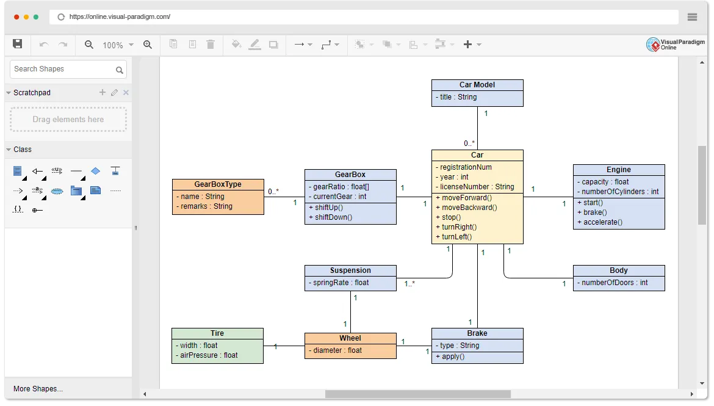
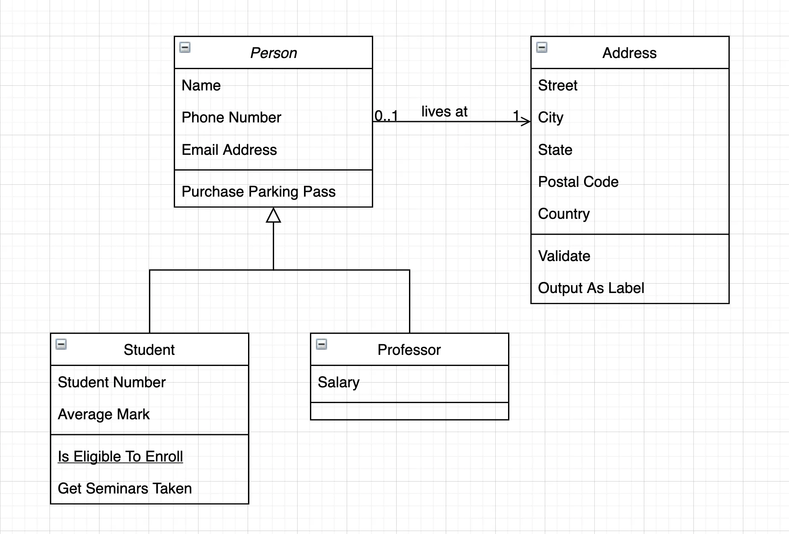
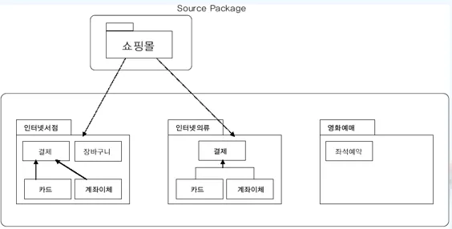

### 소프트웨어 생명 주기

폭포수 모형 : 한 단계가 완전히 끝나야만 다음 단계로

프로토타입 모형 : 실제 개발될 소프트웨어에 대한 견본품

나선형 모형: 여러 번의 소프트웨어 개발 과정

애자일 모형 : 요구사항 변화에 유연하게 대응, 일정한 주기를 반복하며 개발

소프트웨어 공학 : 소프트웨어의 위기를 극복하기 위한 방안으로 연구된 학문

### XP

XP : 요구사항에 유연하게 대응하기 위해 고객의 참여와 개발 과정의 반복을 극대화

Pair Programming : 다른 사람과 함께 프로그래밍 수행

Test Driven Development : 테스트 케이스 먼저 작성

Continuous Integration : 개발된 코드들은 하나의 작업이 마무리 될때마다 지속적으로 통합

Refactoring : 프로그램 기능의 변경 없이 시스템을 재구성

### 요구사항 정의

요구사항 : 소프트웨어가 어떤 문제를 해결하기 위해 제공하는 서비스에 대한 설명 , 제약 조건

기능 요구사항 : 기능이나 수행과 관련된 요구사항

비기능 요구사항: 품질이나 제약사항과 관련된 요구사항

사용자 요구사항 : 사용자 관점에서 본 시스템이 제공해야 할 요구사항

시스템 요구사항 : 개발자 관점에서 본 시스템이 제공해야 할 요구사항

### 요구사항 개발 프로세스

요구사항을 도출하고 분석한 후 명세서에 정리하여 확인 및 검증하는 활동

요구사항 도출 : 시스템 개발에 관련된 사람들이 서로 의견을 교환하여 요구사항을 식별 , 이해

브레인스토밍 : 3인 이상 자유롭게 의견 교환

프로토타이핑 : 견본을 통해 효과적으로 요구 분석

유스케이스 : 사용자의 요구사항을 기능 단위로 표현

요구사항 분석 : 요구사항 중 명확하지 않은 부분을 걸러내기 위한 과정

요구사항 명세  : 분석된 요구사항을 바탕으로 모델을 작성하고 문서화하는 것

요구사항 확인 : 요구사항 명세서가 정확하고 완전하게 작성되었는지를 검토하는 활동

형상관리(SCM) : 개발 과정에서 만들어지는 형상들의 변경 사항을 관리하는 일련의 활동

### 요구사항 분석

개발 대상에 대한 사용자의 요구사항을 이해하고 문서화 하는 활동

구조적 분석 기법 : 자료의 흐름과 처리를 중심

DFD(자료 흐름도), DD(자료 사전), ERD(개체 관계도)

### UML

UML : 시스템 개발 과정에서 의사소통이 원활하게 이루어지도록 표준화한 객체지향 모델링

사물, 관계, 다이어그램

사물의 종류 : 구조 사물(물리적 요소), 행동 사물(요소들의 행위), 그룹 사물, 주해 사물(부가적인 설명)

### UML - 관계

관계  : 사물과 사물 사이의 연관성 표현

연관 관계 : 2개 이상의 사물이 서로 관련되어 있는 관계

집합 관계(Aggregation) : 하나의 사물이 다른 사물에 포함되어 있는 관계 ( 컴퓨터, 프린트 )

포함 관계(Composition) : 포함하는 사물의 변화가 포함되는 사물에게 영향을 미치는 관계 ( 문 , 키 )

일반화 관계(Generalization) : 하나의 사물이 다른 사물에 비해 더 일반적이거나 구체적인 관계 ( 부모, 자식

의존 관계(Dependency) : 서로에게 영향을 주는 짧은 시간 동안만 연관을 유지하는 관계 ( 등급, 할인율 )

실체화 관계(Realization) : 할 수 있거나 해야 하는 기능으로, 서로를 그룹화 할 수 있는 관계 (비행기, 새 → 날 수 있다)

### UML - 다이어그램

다이어그램 : 사물과 관계를 도형으로 표현한 것

구조적 다이어그램 종류

클래스 다이어그램 : 클래스 사이의 관계

객체 다이어그램 : 객체와 객체 사이의 관계, 럼바우

컴포넌트 다이어그램 , 배치 다이어그램 , 복합체 구조 다이어그램 , 패키지 다이어 그램

행위 다이어그램 종류

유스케이스 다이어그램 : 사용자 요구 분석

순차 다이어 그램 : 상호 작용하는 시스템이나 객체들이 주고받는 메시지 표현

커뮤니케이션 다이어그램, 상태 다이어그램, 활동 다이어그램

### 클래스 다이어그램

정적 모델링

클래스와 클래스가 가지는 속성, 클래스 사이의 관계를 표현한 것

구성 요소 : 클래스, 제약조건 , 관계

### 순차 다이어그램

동적 모델링

순차 다이어그램 : 시스템이나 객체들이 메시지를 주고 받으며 상호 작용하는 과정을 그림으로 표현

구성 요소 : 액터, 객체, 생면선, 실행 상자, 메시지, 객체 소멸

### 패키지 다이어그램

요소들을 그룹화한 패키지간의 의존 관계를 표현한 것

구성 요소 : 패키지, 객체, 의존 관계

### S/W 공학의 발전적 추세

소프트웨어 재사용 : 이미 개발되어 인정받은 소프트웨어를 다른 소프트웨어 개발이나 유지에 사용하는 것

소프트웨어 재공학 : 기존 시스템을 이용하여 보다 나은 시스템을 구축하고, 새로운 기능을 추가

CASE : 소프트웨어 개발 과정 전체 또는 일부를 컴퓨터와 전용 소프트웨어 도구를 사용하여 자동화하는 것

### 비용 산정 기법 - 하향식

델파이 : 전문가의 의견을 종합하여 산정하는 기법

### 비용 산정 기법 - 상향식

세부적인 작업 단위별로 비용을 산정한 후 집계하여 전체 비용을 산정하는 방법

LOC 기법 - 예측치 공식 : (a + 4m + b) / 6   a: 낙관 , b : 비관 , m : 기대

노력  = LOC / 1인당 월 평균 생산 코드

개발 비용 = 노력 x 단위 비용(월평균 인건비)

개발 기간 = 노력 / 투입 인원

생산성 = LOC / 노력

### 수학적 산정 기법

COCOMO 모형 : LOC 에 의한 비용산정 기법 , 보헴이 제안

- 조직형 5만 라인 이하
- 반분리형 30만 라인 이하
- 내장형 30만 라인 이상

Putnam 모형 : 소프트웨어 생명 주기의 전 과정 동안에 사용될 노력의 분포 예상

기능 점수 모형 : 기능 점수를 구한 후 비용 산정, 알브레히트 제안

### 프로젝트 일정 계획

PERT(프로그램 평가 및 검토 기술)  : 전체 작업의 상호 관계를 표시하는 네트워크

CPM(임계 경로 기법) : 작업을 나열하고 작업에 팔요한 소요 기간을 예측하는데 사용하는 기법

간트 차트 :  작업 일정을 막대 도표로 이용하여 표시하는 프로젝트 일정표

### 소프트웨어 개발 표준

ISO/IEC 12207  : ISO(국제표준화기구) 에서 만든 표준 소프트웨어 생명 주기 프로세스

CMMI : 소프트웨어 개발 조직의 업무 능력 및 조직의 성숙도 평가

SPICE : 소프트웨어의 품질 및 생산성 향상을 위해 소프트웨어 프로세스를 평가 및 개선하는 국제 표준

### 소프트웨어 개발 프레임워크

개발에 공통적으로 사용되는 구성 요소와 아키텍처를 일반화하여 제공해주는 **반제품** 형태의 소프트웨어 시스템

스프링 프레임워크 : 자바 플랫폼을 위한 오픈 소스 경량형 애플리케이션 프레임워크

전자정부 프레임워크 : 대한민국의 공공부문 정보화 사업 시 기능 및 아키텍처를 제공하는 프레임 워크

닷넷 프레임워크 : Windows 프로그램의 개발 및 실행 환경을 제공하는 프레임워크

프레임워크 특성 : 모듈화 , 재사용성, 확장성, 제어의 역흐름