# 11장.응용 SW 기초 기술 활용

### 운영체제의 종류

Windows : 마이크로소프트사가 개발한 운영체제

UNIX: AT&T 벨 연구소, MIT, General Electric 이 공동 개발한 운영체제

- 대부분 c 언어로 작성
- 커널 : 프로그램과 하드웨어 간의 인터페이스 역할
- 쉘 : 명령어를 인식하여 프로그램을 호출하고 명령을 수행하는 명령어 해석기

LINUX : 리누스 토발즈가 UNIX 기반으로 개발한 운영체제

- 무래 공개, UNIX 와 호환

MacOS : 애플 사가 UNIX 기반으로 개발한 운영체제

Android: 구글사에서 개발한 리눅스 커널 기반 모바일 운영체제

IOS : 애플사에서 개발한 유닉스 기반 모바일 운영체제

### 페이지 교체 알고리즘

페이지 부재가 발생하면 어떤 페이지 프레임을 선택하여 교체할 것인지를 결정하는 기법

OPT(optimal replacement 최적 교체)

앞으로 가장 오랫동안 사용하지 않을 페이지를 교체(벨레이디 제안)

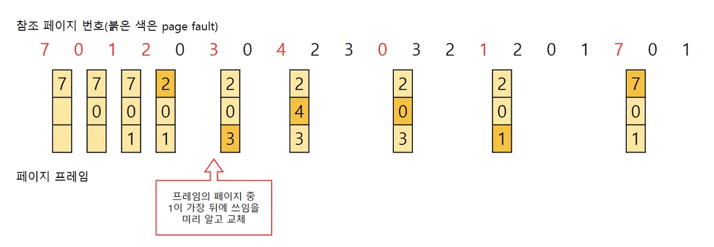

FIFO (First In First Out)

가장 먼저 들어와서 가장 오래 있었던 페이지를 교체하는 기법

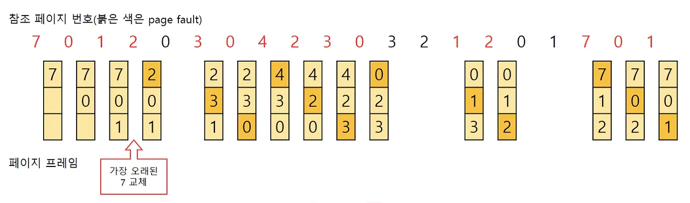

LRU(Least Recently Used)

최근에 가장 오랫동안 사용하지 않은 페이지를 교체

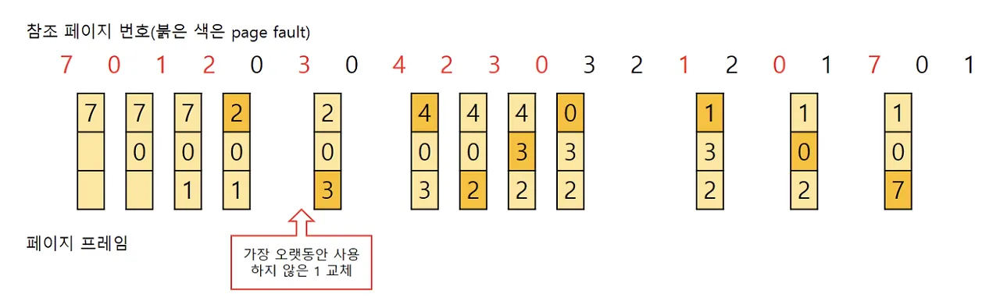

LFU(Least Frequently Used)

사용 빈도가 가장 적은 페이지를 교체하는 기법

NUR(NOT USED RECENTLY) : 최근에 사용하지 않은 페이지를 교체하는 기법

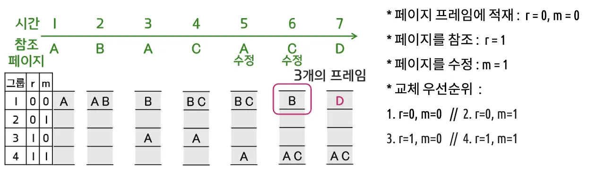

SCR(Second Chance Replacement)

가장 오랫동안 주기억장치에 있던 페이지 중 자주 사용되는 페이지의 교체를 방지 하기 위한 기법

### 가상기억장치 기타 관리 사항

Locality : 프로세스가 실행되는 동안 주기억장치를 참조할 때 일부 페이지만 집중적으로 참조하는 성질

워킹 셋 : 프로세스가 일정 시간 동안 자주 참조하는 페이지들의 집합

스래 싱 : 프로세스의 처리 시간보다 페이지 교체에 소요되는 시간이 더 많아 지는 현상

### 프로세스의 개요

프로세스 : 실행중인 포로그램을 의미

PCB(Process Control Block  프로세스 제어 블록): 운영체제가 프로세스에 대한 정보를 저장해놓는곳

프로세스 상태전이 : 시스템 내의 존재하는 동안 프로세스의 상태가 변하는 것

- 제출(작업 제출), 접수(디스크의 할당 위치에 저장), 준비(프로세서를 할당받기 위해 기다리는 상태)
- 실행(프로세서를 할당받아 실행되는 상태), 대기, 종료(프로세스 할당 해제)

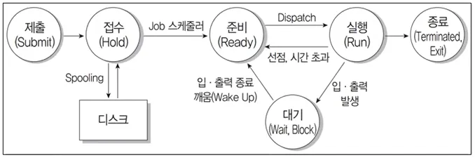

프로세스 상태 전이 관련 용어

Dispatch : 준비상태에서 실행상태로 전이

Wake up : 대기 상태에서 준비상태로 전이

Spooling : 성능 향상을 위해 데이터를 한꺼번에 입 출력하기 위해 디스크에 저장하는 과정

스레드 : 시스템의 여러 자원을 할당받아 실행하는 프로그램의 단위 또는 프로세스 내에서의 작업 단위

### 주요 스케줄링 알고리즘

평균 실행 시간 , 평균 대기 기간, 평균 반환 시간 구하기 문제

FCFS(First Come First Service 선입 선출) = FIFO

도착한 순서에 따라 차례로 CPU를 할당하는 기법

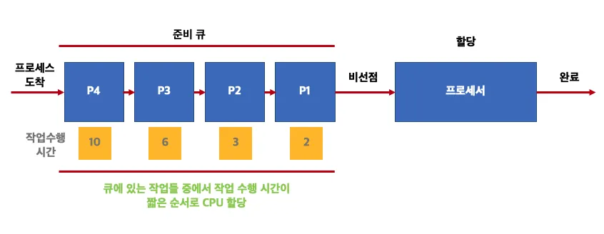

SJF(Shortest Job First)

실행 시간이 가장 짧은 프로세스에게 먼저 COU를 할당하는 기법

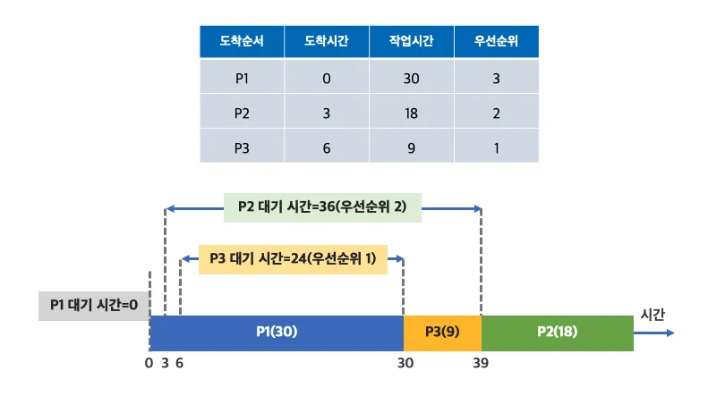

HRN(Highest Response ratio Next)

대기 시간과 실행 시간을 이용하는 기법 (SJF 기법 보완)

우선순위 계산식  = 대기 시간 + 실행 시간 / 서비스 시간

RR(Round Robin)

시간 할당량(Time Slice) 동안만 실행한 후 실행이 완료되지 않으면 다음 프로세스에게 CPU를 넘겨주는 기법

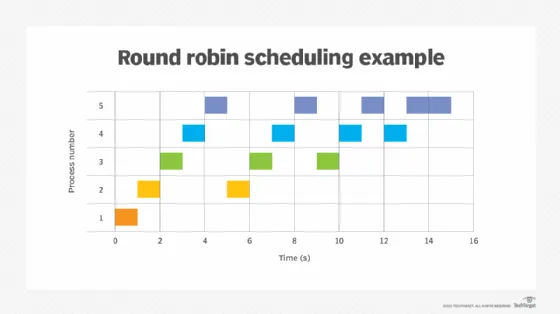

SRT(Shortest Remaining Time)

현재 실행중인 프로세스의 남은 시간과 새로 도착한 프로세스의 실행 시간을 비교하여 가장 짧은 실행 시간을 요구하는 프로세스 에게 CPU를 할당

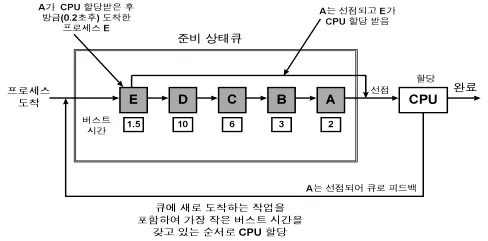

### 운영체제 기본 명령어

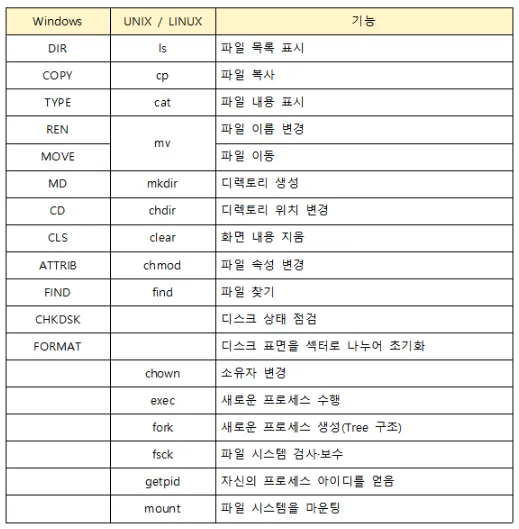

### 인터넷

**인터넷 :** TCP/IP 프로토콜을 기반으로 전 세계의 수많은 컴퓨터와 네트워크들이 연결된 광범위한 컴퓨터 통신망

**IP주소 : 인터넷에 연결된 컴퓨터를 구분하기 위한 고유 주소**

8비트씩 4부분 총 32비트로 구성(IPv4)

네트워크 부분의 길이에 따라 클래스 5단계로 나눔

A class : 국가나 대형 통신망에 사용

B class : 중대형 통신망에 사용

C class : 소규모 통신망에 사용

D class : 멀티캐스트 용으로 상요

E class : 공용 X

서브네팅 :

- 할당된 네트워크 주소를 다시 여러 개의 작은 네트워크로 나누어 사용
- 서브넷 마스크 : 네트워크 주소와 호스트 주소를 구분하기 위한 비트

192.168.1.0/24 에서 /24 는 서브넷 마스크를 의미, 즉 1의 개수가 24개

11111111 11111111 11111111 00000000

**IPv6**

- **IPv4의 주소 부족 문제를 해결하기 위해 개발됨**
- 128비트의 긴 주소를 사용하여 주소 부족 문제를 해결할 수 있고, 자료 전송 속도가 빠름
- 주소 체계
    - 유니캐스트: 1:1 통신
    - 멀티캐스트: 1:N 통신
    - 애니캐스트: 1:1 통신,  (송신자와 가장 가까이 있는 수신자 간의 통신)

**도메인 네임 : IP 주소를 사람이 이해하기 쉬운 문자 형태로 표현한 것**

도메인 네임을 IP 주소로 변환하는 역할을 하는 시스템을 DNS라고 하며,

이런 역할을 하는 서버를 DNS 서버라고 함

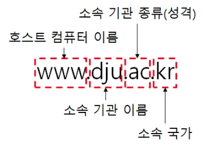

### OSI 참조 모델

### OSI(Open System Interconnection) 참조 모델의 개요

- 다른 시스템 간의 원활한 통신을 위해 ISO(국제표준화기구)에서 제안한 통신 규약(프로토콜)

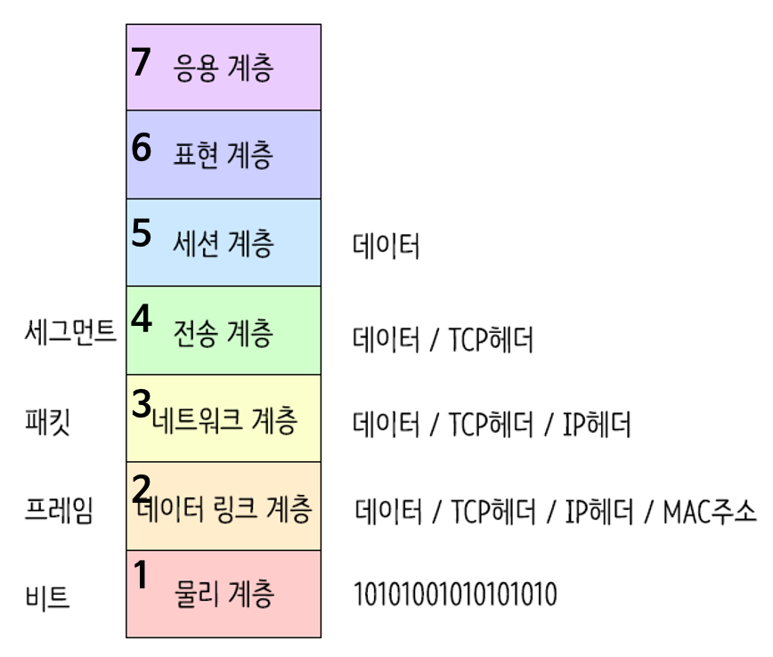

- Application / Presentation / Session / Transport / Network / Datalink / Physical → (아파서티난다 피)

### OSI 모델의 계층

**1계층 - 물리 계층 (Physical Layer)**

- **기능: 실제 접속 및 신호 전송 방식 정의**
- **데이터 단위: 비트**
- **장비: 리피터, 허브**

**2계층 - 데이터 링크 계층 (Data Link Layer)**

- **기능: 동일 네트워크 내의 두 장치 간의 전송을 담당, 신뢰성 있는 정보 전송 (흐름 제어, 오류 제어)**
- **데이터 단위: 프레임**
- **장비: 브리지**

**3계층 - 네트워크 계층 (Network Layer)**

- **기능: 네트워크 연결 관리, 경로 설정**
- **데이터 단위: 패킷**
- **장비: 라우터**

**4계층 - 전송 계층 (Transport Layer)**

- **기능: 서로 다른 네트워크 간의 데이터 전송을 관리하며 종단 시스템 간의 연결을 설정하고 유지, 데이터 전송 서비스 (오류 제어, 흐름 제어)**
- **데이터 단위: 세그먼트**
- **표준: TCP, UDP**

**5계층 - 세션 계층 (Session Layer)**

- **기능: 송수신 간 대화 제어 및 동기 유지**
- **데이터 단위: 메시지**

**6계층 - 표현 계층 (Presentation Layer)**

- **기능: 데이터 변환 (코드 변환, 암호화)**

**7계층 - 응용 계층 (Application Layer)**

- **기능: 사용자와 OSI 환경의 인터페이스 제공**
- **서비스: 정보 교환, 전자 사서함, 가상 터미널**

### **TCP/IP의 개요**

인터넷에 연결된 서로 다른 기종의 컴퓨터들이 데이터를 주고 받을 수 있도록 하는 표준 프로토콜

프로토콜의 기본 요소 :

구문(데이터 형식,부호화,신호레벨),

의미(협조사항, 오류관리 규정),

시간(통신 속도, 순서 제어)

### TCP/IP의 구조

| OSI | TCP/IP | 기능 |  |
| --- | --- | --- | --- |
| 응용 계층 표현 계층 세션 계층 | 응용 계층 | 응용 프로그램 간의 데이터 송수신 제공  | TELNET, FTP, SMTP, SNMP, DNS, HTTP |
| 전송 계층 | 전송 계층 | 호스트들 간의 신뢰성 있는 통신 제공 | TCP, UDP, RTCP |
| 네트워크 계층 | 인터넷 계층 | 데이터 전송을 위한 주소, 경로 지정 | IP,ICMP,IGMP,ARP, RARP |
| 데이터 링크 계층 물리 계층 | 네트워크 액세스 계층 | 실제 데이터를 송수신 | Ethernet, IEEE 802 |

### 응용 계층의 주요 프로토콜

- FTP : 원격 파일 전송 프로토콜
- SMTP : 전자 우편 교환 서비스
- TELNET
    - 원격 접속 서비스
    - 가상 터미널 기능 수행
- SNMP
    - TCP/IP의 관리 프로토콜
    - 네트워크 기기의 네트워크 정보를 네트워크 관리 시스템에 보내는 데 사용되는 프로토콜
- DNS : 도메인 네임을 IP 주소로 매핑하는 시스템
- HTTP : WWW에서 HTML을 송수신하기 위한 표준 프로토콜

### 전송 계층의 주요 프로토콜

- TCP
    - 양방향 연결형 서비스 제공
    - 가상 회선 연결 형태의 서비스 제공
    - 순서 제어, 오류 제어, 흐름 제어 기능을 함
    - 스트림 위주의 패킷 단위 전달
- UDP
    - 비연결형 서비스 제공
    - 실시간 전송에 유리하며, 신뢰성보다는 속도가 중요시되는 네트워크에서 사용
- RTCP
    - 패킷의 전송 품질을 제어하기 위한 제어 프로토콜
    - 세션에 참여한 각 참여자들에게 주기적으로 제어 정보를 전송
    - 데이터 전송을 모니터링하고 최소한의 제어와 인증 기능만을 제공
    - 패킷은 항상 32비트의 경계로 끝남

### 인터넷 계층의 주요 프로토콜

- IP : 전송할 데이터에 주소를 지정하고 경로를 설정
- ICMP
    - IP와 조합하여 통신 중에 발생하는 오류의 처리와 전송 경로 변경 등을 위한 제어 메시지를 관리
    - 헤더는 8Byte로 구성
- IGMP : 멀티캐스트를 지원하는 호스트나 라우터 사이에서 멀티캐스트 그룹 유지를 위해 사용
- ARP : IP 주소를 MAC Address로 변환 (논리 주소 → 물리 주소)
- RARP : ARP의 반대로 MAC Address를 IP 주소로 변환 (물리 주소 → 논리 주소)

### 네트워크 액세스 계층의 주요 프로토콜

- IEEE 802 : LAN을 위한 표준 프로토콜
    - IEEE 802.3(Ethernet) : CSMA/CD 방식의 LAN
    -
- HDLC : 비트 위주의 데이터 링크 제어 프로토콜
- X.25 : 패킷 교환망을 통한 DTE와 DCE 간의 인터페이스를 제공하는 프로토콜DTE(신호 단말 장치), DCE(신호 통신 장비)
- RS-232C : 공중전화 교환망을 통한 DTE와 DCE 간의 인터페이스를 제공하는 프로토콜

### 네트워크 관련 신기술

- **IoT (사물인터넷): 실세계와 가상 세계의 다양한 사물과 사람을 인터넷으로 연결해 진보된 서비스를 제공하는 기술.**
- **M2M (사물 통신): 기계 간의 무선 통신.**
- **모바일 컴퓨팅: 이동 중에도 네트워크에 접속해 업무를 처리할 수 있는 환경.**
- **클라우드 컴퓨팅: 중앙 컴퓨터에 자원을 두고 인터넷을 통해 언제 어디서나 작업 수행.**
- **모바일 클라우드 컴퓨팅: 모바일 기기로 클라우드 서비스를 이용해 정보와 자원을 공유하는 기술.**
- **인터클라우드 컴퓨팅: 서로 다른 클라우드 서비스를 연결해 자원의 동적 할당 가능.**
- **매시 네트워크: 대규모 장치 네트워크 생성에 최적화된 새로운 네트워크 기술.**
- **와이선: 저전력 장거리 통신 기술, 사물인터넷 서비스에 적합.**
- **NDN (Named Data Networking): 콘텐츠 정보와 라우터 기능으로 데이터 전송.**
- **NGN (차세대 통신망): 이동 사용자도 지원하는 유선 기반의 차세대 통신망.**
- **SDN (Software Defined Networking): 네트워크를 소프트웨어로 가상화하고 관리하는 기술.**
- **NFC (근거리 무선 통신): 고주파를 이용한 근거리 통신 기술.**
- **UWB (Ultra WideBand): 짧은 거리에서 대량의 데이터를 낮은 전력으로 전송하는 기술.**
- **피코넷: 블루투스나 UWB를 사용해 여러 장치가 통신망을 형성하는 기술.**
- **WBAN (Wireless Body Area Network): 몸에 착용하는 센서나 기기를 무선으로 연결하는 기술.**
- **GIS (지리정보시스템): 지리적 자료를 수집하고 분석하는 시스템.**
- **USN (Ubiquitous Sensor Network): 다양한 센서로 정보를 무선으로 수집하는 네트워크.**
- **SON (Self Organization Network): 주변 환경에 맞춰 스스로 네트워크를 구성하는 기술.**
- **애드 혹 네트워크: 고정 유선망 없이 모바일 호스트로 구성하는 네트워크 (재난 상황 등).**
- **네트워크 슬라이싱: 5G의 핵심 기술로, 하나의 물리적 네트워크를 여러 가상 네트워크로 분리해 맞춤형 서비스 제공.**
- **저전력 블루투스 기술: 연결되지 않은 상태에서 절전 모드를 유지하는 블루투스 기술.**
- **지능형 초연결망: 급증하는 데이터 트래픽을 효과적으로 수용하기 위한 정부 주관 사업.**

### 네트워크 구축

네트워크 설치 구조

- 정보를 전달하기 위해 통신 규약에 의해 연결한 통신 설비의 집합

성형(중앙 집중형)

- 중앙 컴퓨터에 단말 장치들이 연결되는 구조
- Point-to-Point 방식으로 연결

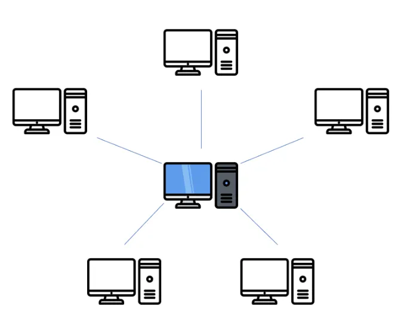

링형(루프형)

- 컴퓨터와 단말 장치들을 서로 이웃하는 것끼리 Point-to-Point 방식으로 연결

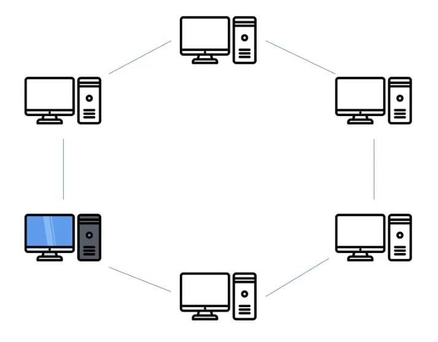

버스형

- 한 개의 통신 회선에 여러 대의 단말 장치가 연결되어 있는 형태
- 단말 장치가 고장이 나도 전체에 영향을 주지 않음

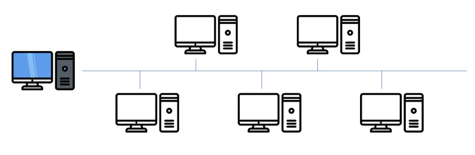

계층형(분산형)

- 중앙 컴퓨터와 일정 지역의 단말 장치까지는 하나의 회선으로 연결시키고, 이웃하는 단말 장치는 일정 지역 내에 설치된 중간 단말 장치로부터 다시 연결

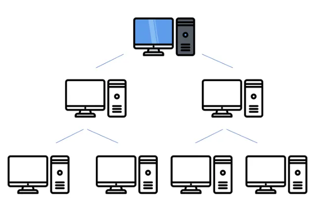

망형(메쉬형)

- 모든 지점의 컴퓨터와 단말 장치를 서로 연결시킨 상태
- 많은 양의 통신을 필요로 하는 경우에 사용
- 필요한 포트의 수 = 노드 수 - 1
- 필요한 회선의 수 = 노드 수*(노드 수-1) / 2

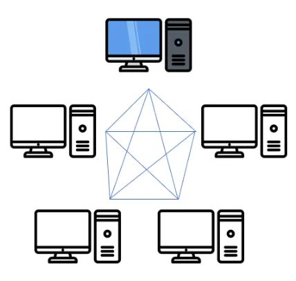

네트워크 분류

- 근거리 통신망(LAN)
    - 비교적 가까운 거리에 있는 노드들을 연결하여 구성
    - 주로 버스형이나 링형 구조를 사용
- 광대역 통신망(WAN)
    - 국가와 국가, 대륙과 대륙 등 멀리 떨어진 사이트들을 연결하여 구성
    - 일정 지역은 LAN으로 연결하고 각 LAN을 연결하는 방식을 사용

NAT(네트워크 주소 변환) : 한 개의 정식 IP 주소에 대량의 가상 사설 IP 주소를 할당 및 연결하는 기능

### **경로 / 트래픽 제어**

경로제어 : 전송 경로 중에서 최적 패킷 교환 경로를 결정하는 기능

IGP(내부 게이트웨이 프로토콜)

- 하나의 자율 시스템(AS) 내의 라우팅에 사용
- RIP : 현재 가장 널리 사용되며, 소규모 네트워크에서 효율적인 방법

EGP(외부 게이트웨이 프로토콜)

- 자율 시스템 / 게이트웨이 간의 라우팅에 사용되는 프로토콜

BGP

- 자율 시스템 간의 라우팅 프로토콜

트래픽 제어 : 전송되는 패킷의 흐름, 양을 조절하는 기능

- 정지 - 대기 : 수신 측에서 확인 신호를 받아야 다음 패킷을 전송
- 슬라이딩 윈도우 : 확인 신호를 이용하여 송신 데이터의 양을 조절

### SW 관련 신기술 용어

- 인공지능 : 인간의 두뇌와 같이 컴퓨터 스스로 추론, 학습, 판단 등 인간 지능적인 작업을 수행하는 시스템
- 뉴럴링크 : 테슬라의 CEO 일론 머스크가 사람의 뇌와 컴퓨터와 결합하는 기술을 개발하기 위해 설립한 회사
- 딥 러닝 : 인간의 두뇌를 모델로 만들어진 인공 신경망을 기반으로 하는 기계 학습 기술
- 전문가 시스템 : 특정 분야의 전문가가 수행하는 고도의 업무를 지원하기 위한 컴퓨터 응용 프로그램
- 증강현실 : 실제 촬영한 화면에 가상의 정보를 부가하여 보여주는 기술
- 블록체인 : P2P 네트워크를 이용하여 온라인 금융 거래 정보를 온라인 네트워크 참여자의 디지털 장비에 분산 저장하는 기술
- 분산 원장 기술 : 중앙 관리자나 중앙 데이터 저장소가 존재하지 않고, P2P 망내의 참여자들에게 모든 거래 목록이 분산 저장되어 거래가 발생할 때마다 지속적으로 갱신되는 디지털 원장
- 해시 : 임의의 길이의 입력 데이터나 메시지를 고정된 길이의 값이나 키로 변환
- 양자 암호키 분배 : 양자 통신을 위해 비밀키를 분배하여 관리하는 기술
- 프라이버시 강화 기술 : 개인 정보 위험 관리 기술
- 공통 평가 기준 : ISO 15408 표준으로 채택된 정보 보호 제품 평가 기준
- 개인정보 영향평가 제도 : 개인정보를 활용하는 새로운 정보 시스템의 도입 및 기존 정보시스템의 중요한 변경 시, 시스템의 구축 및 운영이 기업의 고객은 물론 국민의 사생활에 미칠 영향에 대해 미리 조사, 분석, 평가하는 제도
- 그레이웨어 : 소프트웨어를 제공하는 입장에서는 악의적이지 않은 유용한 소프트웨어일지라도, 사용자 입장에서는 유용할 수도 있고 악의적일 수도 있는 악성 코드나 공유 웨어
- 매시업 : 웹에서 제공하는 정보 및 서비스를 이용하여 새로운 소프트웨어나 서비스 데이터베이스 등을 만드는 기술
- 리치 인터넷 애플리케이션 : 플래스 애니메이션 기술과 웹 서버 애플리케이션 기술을 통합하여 기존 HTML보다 역동적인 웹페이지를 제공하는 플래시 웹페이지 제작 기술
- 시맨틱 웹 : 컴퓨터가 사람을 대신하여 정보를 읽고 이해하고 가공하여 새로운 정보를 만들어 낼 수 있도록 이해하기 쉬운 의미를 가진 차세대 지능형 웹
- 증발품 : 판매 계획 또는 배포 계획은 발표되었으나 실제로 고객에게는 판매되거나 배포되지 않고 있는 소프트웨어
- 오픈 그리드 서비스 아키텍처 : 기업의 소프트웨어 인프라인 정보시스템을 공유와 재사용이 가능한 서비스 단위나 컴포넌트 중심으로 구축하는 정보기술 아키텍처
- 서비스형 소프트웨어(SaaS) : 소프트웨어의 여러 기능 중에서 사용자가 필요로 하는 서비스만 이용할 수 있도록 한 소프트웨어
- 소프트웨어 에스크로 : 소프트웨어 개발자의 지적재산권을 보호하고, 사용자는 저렴한 비용으로 소프트웨어를 안정적으로 사용 및 유지보수 받을 수 있도록 소스 프로그램과 기술 정보 등을 제3의 기관에 보관하는 것
- 복잡 이벤트 처리 : 실시간으로 발생하는 많은 사건들 중 의미가 있는 것만을 추출할 수 있도록 사건 발생 조건을 정의하는 데이터 처리 방법
- 디지털 트윈 : 현실 속의 사물을 소프트웨어로 가상화한 모델

### 소프트웨어 개발 보안 활동 관련 법령 및 규정

IT 기술 관련 규정

- RFID 프라이버시 보호 가이드라인 : RFID 이용자들의 프라이버시 보호
- 위치정보의 보호 및 이용 등에 관한 법률 : 개인 위치정보의 유출 및 오남용 방지
- 바이오정보 보호 가이드라인 : 개인 바이오정보의 보호와 안전한 활용을 위한 원칙
- 정보보호 관리 체계(ISMS) 정보 자산을 보호하기 위한 절차와 대책, 한국인터넷진흥원 에서 평가 및 인증 업무 수행

### HW 관련 신기술

- 고가용성 : 긴 시간동안 안정적인 서비스 운영을 위해 장애가 발생한 즉시, 다른 시스템으로 대체 가능한 환경을 구축하는 메커니즘
- 3D 프린팅 : 평면에 출력하는 것이 아닌 얇은 두께로 한층 한층 적재시켜 하나의 형태를 만들어내는 기술
- 4D 프린팅 : 특정 시간이나 환경 조건이 갖추어지면 스스로 형태를 변화시키거나 제조되는 자가 조립 기술이 적용된 제품을 3D 프린팅 하는 기술
- RAID : 여러 개의 하드디스크로 디스크 배열을 구성하여 파일을 구성하며, 파일을 구성하고 있는 데이터 블록들을 서로 다른 디스크들에 분산 저장하는 기술
- 앤 스크린 : N개의 서로 다른 단말기에서 동일한 콘텐츠를 자유롭게 이용할 수 있는 서비스
- 컴패니언 스크린 : TV 방송 시청 시 방송 내용을 공유하며 추가적인 기능을 수행할 수 있는 디바이스
- 씬(Thin) 클라이언트 PC : 하드디스크나 주변 장치 없이 기본적인 메모리만 갖추고 서버와 네트워크로 운용되는 개인용 컴퓨터
- 멤스 : 초정밀 반도체 기술을 바탕으로 센서나 액추에이터 등 기계 구조를 다양한 기술로 미세 가공하여 전기기계적 동작을 할 수 있도록 한 초미세 장치
- 패블릿 : 태블릿 기능을 포함한 5인치 이상의 대화면 스마트폰
- 트러스트존 기술 : ARM에서 개발한 하나의 프로세서 내에 일반 애플리케이션을 처리하는 일반 구역과 보안이 필요한 애플리케이션을 처리하는 보안 구역으로 분할하여 관리하는 하드웨어 기반의 보안 기술
- 엠디스크 : 한 번의 기록만으로도 자료를 영구 보관할 수 있는 광 저장 장치
- 멤리스터 : 메모리와 레지스터의 합성어로, 전류의 방향 및 전류량 등 기존의 경험을 모두 기억하는 소자

### DB 관련 신기술

- 빅데이터 : 기존의 관리 방법이나 분석 체계로는 처리하기 어려운 막대한 양의 정형 / 비정형 데이터 집합
- 브로드 데이터 : 다양한 채널에서 소비자와 상호 작용을 통해 생산된 데이터, 기업 마케팅에 있어 효율적이고 다양한 데이터, 이전에 사용하지 않았거나 몰랐던 새로운 데이터, 기존 데이터에 새로운 가치가 더해진 데이터
- 메타 데이터 : 일련의 데이터를 정의하고 설명해주는 데이터
- 디지털 아카이빙 : 디지털 정보 자원을 장기적으로 보존하기 위한 작업
- 하둡 : 오픈 소스를 기반으로 한 분산 컴퓨팅 플랫폼
- 타조 : 우리나라가 주도적으로 개발 중인 하둡 기반의 분산 데이터 웨어하우스 프로젝트
- 데이터 다이어트 : 데이터를 삭제하는 것이 아닌, 압축하고, 중복된 정보를 배제하며 새로운 기분에 따라 나누어 저장하는 작업
- 데이터 마이닝 : 대량의 데이터 분석 및 상호 관계 규명
- OLAP : 다차원으로 이루어진 데이터로부터 통계적인 요약 정보 분석

### **회복 / 병행제어**

회복 : 데이터베이스가 손상 되었을 때 손상되기 이전의 정상 상태로 복구

- 연기 갱신 기법 : 트랜잭션이 성공적으로 완료될 때 까지 실질적인 갱신을 연기하는 방법
- 즉각 갱신 기법 : 트랜잭션이 데이터를 갱신하면 즉시 실제 데이터베이스에 반영하는 방법
- 그림자 페이지 대체 기법 : 갱신 이전의 데이터베이스를 일정 크기의 페이지 단위로 구성하여 각 페이지 마다 복사본 페이지를 별도 보관해놓고  해당 복사본을 대체하여 회복시키는 방법
- 검사점 기법 : 트랜잭션 실행 중 특정 단계에서 재실행할 수 있도록 정보를 로그에 보관해 두고 장애 발생시 검사점 부터 회복 작업 수행

병행 제어 : 동시에 실행되는 트랜잭션 간의 상호작용을 제어하는 것

- 로킹(Locking) : 트랜잭션들이 액세스 하기 전에 LOCK 을 요청해서 LOCK 이 허락되어야만 액세스 할 수 있도록 하는 기법
- 타임 스탬프 순서 : 트랜잭션이 시작하기 전에 타임스탬프를 부여하여 부여된 시간에 따라 트랜잭션 작업 수행
- 최적 병행수행
- 다중 버전 기법

### 교착 상태

서로 다른 프로세스가 점유하고 있는 자원을 요구하며 무한정 기다리는 현상

해결 방법

- 예방 기법
- 회피 기법 : 은행원 알고리즘
- 발견 기법
- 회복 기법