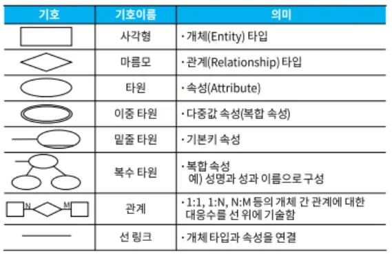
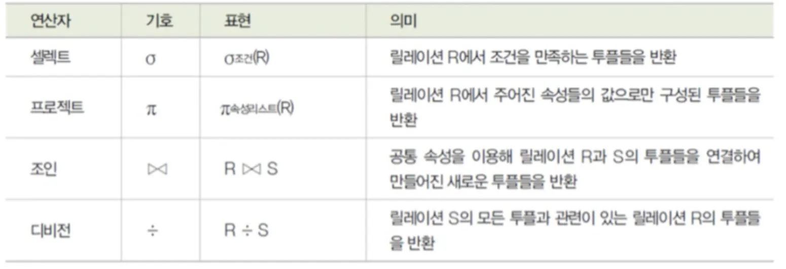
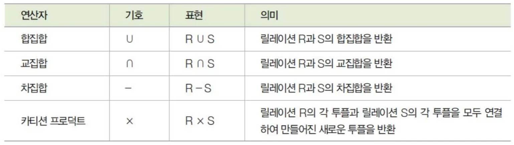

### 데이터베이스 개요

데이터베이스 : 공동으로 사용될 데이터를 중복을 배제하여 통합, 저장하여 항상 사용할 수 있도록 운영하는 운영 데이터

DBMS : 사용자의 요구에 따라 정보를 생성해주고 데이터베이스를 관리해주는 소프트웨어

정의, 조작, 제어 기능

스키마 : 데이터베이스의 구조와 제약조건에 관한 전반적인 명세를 기술한 것이다.

외부스키마(개인의 입장에서 필요한 데이터 베이스),

개념스키마(모든 사용자) ,

내부스키마(물리적 저장장치)

### 데이터 베이스 설계

무결성: 연산 후에도 제약조건을 항상 만족

일관성 : 데이터가 변함없이 일정해야 함

회복 : 장애가 발생했을때 직전의 상태로 복구 가능

보안 : 데이터의 노출, 손실 로부터 보호

효율성 : 최적화, 응답시간 단축

확장 : 운영에 영향을 주지 않으면서 데이터를 추가할 수 있어야 함

요구 조건 분석 : 요구사항 명세서 작성

→ 개념적 설계(개념화) : 개념스키마, 트랜잭션 모델링, E-R 모델

→ 논리적 설계(데이터 모델링) : 논리스키마 설계, 트랜잭션 인터페이스 설계

→ 물리적 설계(데이터 구조화) : 목표 DBMS 에 맞는 물리적 구조의 데이터로 변환

→ 구현 : DDL 로 데이터베이스 생성, 트랜잭션 생성

### 데이터 모델의 개념

데이터 모델 : 현실 세계의 정보들을 추상화하여 표현한 모형

구성 요소 : 개체, 속성, 관계

개념적 데이터 모델 : 현실 세계에 대한 인식을 추상적 개념으로 표현

논리적 데이터 모델 : 컴퓨터 세계의 환경에 맞도록 변환

데이터 모델에 표시할 요소  : 구조(개체간의 관계), 연산(데이터베이스 조작), 제약 조건(실제 데이터의 논리적인 제약 조건)

### E-R 모델

### 관계형 데이터베이스의 구조/ 관계형 데이터 모델

2차원적인 표(table)을 이용해서 데이터 상호 관계를 정의하는 데이터 베이스

릴레이션 : 릴레이션 스키마(속성), 릴레이션 인스턴스(튜플)

튜플 : 릴레이션을 구성하는 각각의 행

속성 : 데이터베이스를 구성하는 가장 작은 논리적 단위

도메인 : 하나의 속성이 취할 수 있는 같은 타입의 원자 값들의 집합

릴레이션 특징 :

튜플들은 모두 다르다

튜플 사이에는 순서가 없다,

튜플을 식별하기 위해 속성들의 부분집합을 키로 설정한다

속성의 값은 더이상 쪼갤 수 없는 원자 값 만을 저장한다.

### 관계형 데이터베이스의 제약 조건 - 키

후보키 : 속성들 중에서 튜플을 유일하게 식별하기 위해 사용되는 속성들의 부분집합)(유일성 최소성)

기본키 : 후보키 중 선정된 주 키

대체키 : 기본키를 제외한 나머지 후보키

슈퍼키 : 속성들의 집합으로 구성된 키(유일성은 만족, 최소성은 x )

외래키 : 다른 릴레이션의 기본키를 참조하는 속성

### 관계형 데이터베이스의 제약 조건 - 무결성

데이터베이스에 저장된 데이터 값과 실제 값이 일치하는 정확성

개체 무결성 : 기본키를 구성하는 어떤 속성도 Null 값이나 중복값을 가질 수 없다

참조 무결성 : 외래키값은 Null 이거나 참조 릴레이션의 기본키 값과 동일해야 함

### 관계대수 및 관계해석

관계 대수 : 원하는 정보와 그 정보를 검색하기 위해서 어떻게 유도하는가를 기술하는 절차적인 언어

순수 관계 연산자(!!결과까지 숙지) :

일반 집합 연산자:

관계 해석 : 관계 데이터의 연산을 표현하는 방법

### 이상 / 함수적 종속

이상(Anomaly) : 테이블에서 데이터의 중복이 발생하고 이 중복으로 인해 문제가 발생하는 현상

종류 : 삽입 이상 , 삭제 이상, 갱신 이상

함수적 종속 : X의 값 각각에 대해 시간에 관계없이 항상 속성 Y 의 값이 오직 하나만 연관되어 있을때

X 를 결정자, Y를 종속자 라고 한다.  ( X → Y )

완전 함수적 종속 : 기본키에 의해 결정

부분 함수정 종속 : 기본키의 일부에 의해 결정

### 정규화

테이블의 속성들이 상호 종속적인 관계를 갖는 특성을 이용하여 테이블을 무손실 분해 하는 과정이다.

제 1 정규형 : 도메인이 원자값

제 2 정규형 : 부분적 함수 종속 제거

제 3 정규형 : 이행적 함수적 종속을 만족하지 않는 정규형

BCNF : 결정자이면서 후보키가 아닌 것 제거

제 4 정규형 : 다중 값 종속 제거

제 5 정규형 : 조인 종속

### 반정규화

정규화된 데이터 모델을 의도적으로 통합, 중복, 분리하여 정규화 원칙을 위배하는 행위

테이블 통합, 테이블 분할(수직, 수평), 중복 테이블 추가(데이터 추출 사용), 중복 속성 추가(조회하는 경로 단축)

### 트랜잭션 분석 / CRUD 분석

데이터베이스의 상태를 변환시키는 하나의 논리적 기능을 수행하기 위한 작업의 단위

특성 :

원자성(Atomicity) : 모두 반영(Commit) Or 전혀 반영되지 않도록(Rollback)

일관성(Consistency) : Commit → 일관성있는 데이터 베이스

독립성(Isolation) : 동시에 병행 실행되는 경우 다른 트랜잭션의 연산이 끼어 들 수 없음

영속성(Durability) : 성공적으로 완료된 트랜잭션 결과는 영구적으로 반영

CRUD 분석

프로세스와 테이블 간에 CRUD 매트릭스를 만들어서 트랜잭션을 분석하는 것

### 뷰/ 클러스터

뷰 : 접근이 허용된 자료만들 제한적으로 보여주기 위해 기본 테이블로부터 유도된, 가상 테이블이다.

클러스터 : 동일한 성격의 데이터를 동일한 데이터 블록에 저장하는 물리적 저장 방법이다.

### 파티션

대용량의 테이블이나 인덱스를 작은 논리적 단위인 파티션으로 나누는 것 → 쿼리 성능 향상 , 디스크 성능 향상

### 데이터베이스 이중화 / 서버 클러스터링

이중화 : 서비스 중단, 손상을 복구하기 위해 동일한 데이터베이스를 복제하여 관리하는 것(Eager, Lazy)

클러스터링 : 두 대 이상의 서버를 하나의 서버처럼 운영하는 기술이다. (고가용성, 병렬 처리)

RTO(Recovery Time Objective) 목표 복구 시간 → 업무 중단 시점으로부터 복구되어 가동될 때 까지 소요 시간

RPO(Recovery Point Objective) 목표 복구 시점 : 업무 중단 시점으로부터 데이터를 복구할 수 있는 기준점

### 데이터베이스 보안

암호화 : 평문을 암호문으로 바꾸는 과정

복호화 : 암호문을 원래의 평문으로 바꾸는 과정

개인키 암호 방식, 공개키 암호 방식

접근 통제 : 데이터가 저장된 객체와 이를 사용하려는 주체 사이의 정보 흐름을 제한 하는 것

3요소 : 정책, 메커니즘, 보안모델

접근통제 기술 :

임의 접근통제(사용자 신원), 강제 접근통제(객체의 등급), 역할기반 접근통제(역할에 따라)

접근통제 정책 :

신분 기반 정책(신분에 근거),  IBP(단일 주체) GBP(복수 주체)

규칙 기반 정책(권한에 근거),  MLP(기사용자나 객체별로 지정), CBP(집단별로 지정)

역할 기반 정책

### 데이터베이스 백업

로그 파일 : 데이터베이스의 처리 내용이나 이용 상황 등 상태변화를 시간의 흐름에 따라 모두 기록한 파일

과거상태로 복귀(Undo), 현재상태로 재생(Redo)

### 스토리지

대용량의 데이터를 저장하기 위해 서버와 저장장치를 연결하는 기술

DAS : 서버와 저장장치를 전용 케이블로 직접 연결하는 방식

NAS : 서버와 저장장치를 네트워크를 통해 연결하는 방식

SAN : 서버와 저장장치를 연결하는 전용 네트워크를 별도로 구성하는 방식

### 자료구조

선형(배열, 리스트, 스택, 큐, 테크) , 비선형(트리, 그래프)

배열 : 크기와 형(Type) 이 동일한 자료들이 순서대로 나열된 자료의 집합

리스트 : 빈 공간 없이 차례대로 데이터가 저장(연속, 연결)

스택 : 리스트의 한쪽 끝으로만 자료의 삽입, 삭제 작업이 이루어짐

큐 : 리스트의 한쪽에서는 삽입, 한쪽에서는 삭제가 이루어짐

그래프 : 정점과 간선의 두 집합으로 이루어지는 구조

### 이진 트리

차수(Degree) 가 2 이하인 노드들로 구성된 트리, 자식이 둘 이하

Preorder 운행 : Root → Left → Right

Inorder : Left → Root → Right

Postorder : Left → Right → Root

전위 표기법 : 연산자 → Left → Right

중위 표기법 : Left → 연산자 → Right

후위 표기법 : Left → Right → 연산자

### 정렬

삽입 정렬 : 기준이 되는 숫자와 그 앞에있는 숫자를 비교하여 조건에 맞게 정렬을 하는 방법

선택 정렬 :  **해당 순서에 원소를 넣을 위치는 이미 정해져 있고, 그 위치에 어떤 원소를 넣을지 선택하는 알고리즘**

버블 정렬 : 더 큰 숫자를 뒤로 보내 차곡차곡 쌓아 정렬하는 방법

쉘 정렬, 퀵 정렬, 힙 정렬, 2-way 합병 정렬, 기수 정렬