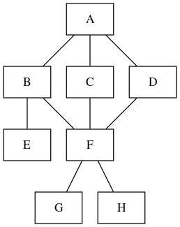

### 소프트웨어 아키텍처

소프트웨어를 구성하는 요소들 간의 관계를 표현하는 시스템의 구조 또는 구조체이다.

모듈화 : 시스템의 기능들을 모듈(특정 기능을 처리)단위로 나누는 것

추상화 : 전체적이고 포괄적인 개념을 설계한 후 세분화하여 구체화시켜 나가는 것

과정, 데이터, 제어

단계적 분해 : 상위의 중요 개념으로부터 하위의 개념으로 구체화 시키는 분할 기법

정보 은닉 : 모듈 내부에 포함된 절차와 자료들의 정보가 감추어져 다른 모듈이 접근하거나 변경하지 못하도록 하는 기법

소프트웨어 아키텍처 설계 과정

설계 목표 설정 → 시스템 타입 결정 → 아키텍처 패턴 적용 → 서브시스템 구체화 → 검토

협약에 의한 설계 : 컴포넌트를 설계할 떄 클래스에 대한 여러 가정을 공유할수 있도록 명세

### 아키텍처 패턴

아키텍처를 설계할 때 참조할 수 있는 전형적인 해결 방식 또는 예제

레이어 패턴 : 시스템을 계층으로 구분하여 구성하는 패턴

클라이언트 서버 패턴 : 하나의 서버 컴포넌트와 다수의 클라이언트 컴포넌트로 구성되ㅏ는 패턴

파이프 필터 패턴 : 각 단계를 필터로 캡슐화하여 파이프를 통해 전송하는 패턴

모델 뷰 컨트롤러 패턴 : 서브시스템을 모델 뷰 컨트롤러로 구조화하는 패턴

마스터-슬레이브, 브로커(브로커가 연결),

피어 투 피어 패턴(피어 컴포넌트가 클라이언트 혹은 서버가 될 수 있음),

이벤트 버스 패턴(이벤트 메시지, 구독, 리스너),

블랙보드 패턴(모든 컴포넌트들이 접근 가능),

인터프리터 패턴(각 라인을 수행하는 방법 지정)

### 객체지향

각 요소들을 객체로 만든 후, 객체들을 조립해서 소프트웨어 개발

구성 요소 : 객체, 클래스, 메시지

특징 : 캡슐화, 상속, 다형성, 연관성

객체 : 데이터와 이를 처리하기 위한 함수를 묶어 놓은 소프트웨어 모듈

클래스 : 공통된 속성과 연산을 갖는 객체의 집합

메시지 : 객체들 간의 상호작용을 하는데 사용되는 수단

캡슐화(Encapsulation) : 외부에서의 접근을 제한하기 위해 인터페이스를 제외한 세부 내용을 은닉하는 것

상속(Inheritance) : 상위 클래스의 모든 속성과 연산을 하위 클래스가 물려받는 것

다형성(Polymorphism) : 하나의 메시지에 대해 각각의 객체가 고유한 방법으로 응답할 수 있는 능력

### 객체지향 분석 및 설계

사용자의 요구사항과 관련된 객체, 속성, 연산,관계 등을 정의하여 모델링하는 작업

럼바우 방법: 모든 소프트웨어 구성 요소를 그래픽 표기법을 이용하여 모델링(객체 → 동적 → 기능)

부치 방법 : 미시적 개발 프로세스와 거시적 개발 프로세스 사용

Jacobson 방법 : 유스케이스를 강조하여 사용

Coad  ,Yourdon : E-R 다이어 그램 사용

Wirfs-Brock 방법 : 분석과 설계 간의 구분이 없고, 고객 명세서 평가

객체지향 설계 원칙

SRP(단일 책임원칙) : 객체는 단 하나의 책임

OCP(개방 폐쇄 원칙) : 기존의 코드 추가하지 않고 기능 추가

LSP(리스코프 치환 원칙) : 자식클래스는 부모클래스의 기능 대체 가능

ISP(인터페이스 분리 원칙) : 사용하지 않는 인터페이스의 영향을 받지 않아야 함

DIP(의존 역전 원칙) : 추상성이 높은 클래스와 의존 관계를 맺어야 한다는 원칙

### 모듈

모듈화를 통해 분리된 시스템의 각 기능

결합도 : 모듈 간에 상호 의존하는 정도 (낮을수록 품질이 좋음)
자료 → 스탬프 → 제어 → 외부 → 공통 → 내용    (오른쪽으로 갈수록 강함)

내용 : 내부 기능 및 내부 자료 참조

공통 : 공통 데이터 영역

외부 : 데이터를 외부의 다른 모듈에서 참조

제어 : 다른 모듈의 논리적인 흐름 제어

스탬프 : 인터페이스로 배열이나 레코드등의 자료구조 전달

자료 : 인터페이스가 자료 요소로만 구성

응집도 : 모듈의 내부 요소들이 서로 관련되어 있는 정도 (강할 수록 품질이 좋음)

우연 → 논리 → 시간 → 절차 → 교환 → 순차 → 기능 (오른쪽으로 갈수록 강함)

기능 : 모든 기능 요소들이 단일 문제와 연관되어 수행

순차 : 하나의 활동으로부터 나온 출력 데이터를 그 다음 활동의 입력데이터로 사용

교환 : 동일한 입력과 출력을 사용하여 서로 다른 기능 수행

절차 : 구성요소 들이 그 기능을 순차적으로 수행할 경우의 응집도

시간 : 특정 시간에 처리되는 기능을 모아 하나의 모듈로 작성

논리 : 유사한 성격 , 특정 형태로 분류

우연 : 서로 관련 없는 요소로만 구성

팬인 : 어떤 모듈을 제어하는 모듈의 수

팬아웃 : 어떤 모듈에 의해 제어되는 모듈의 수

N-S 차트 : 논리의 기술에 중점을 두고 도형을 이용해 표현하는 방법

### 단위 모듈

한가지 동작을 수행하는 기능을 모듈로 구현한 것

IPC(Inter Process Communication)

모듈간 통신 방식을 구현하기 위해 사용되는 대표적인 프로그래밍 인터페이스 집합

Shared Memory : 다수의 프로세스 통신

Socket : 네트워크 소켓을 이용하여 프로세스 간에 통신

Semaphores : 공유 자원에 대한 접근 제어

Pipes&named Pipes :  Pipe 형태의 메모리를 여러 프로세스가 공유하여 통신

Message Queueing : 메시지가 발생하면 이를 전달하는 방식

테스트 케이스 : 소프트웨어가 사용자의 요구사항을 정확하게 준수했는지를 확인하기 위한 명세서

### 공통 모듈

여러 프로그램에서 공통으로 사용할 수 있는 모듈

### 디자인 패턴

모듈간의 관계 및 인터페이스를 설계할 때 참조할 수 있는 전형적인 해결 방식

생성 패턴 : 클래스나 객체의 생성과 참조과정을 정의하는 패턴

- 추상 팩토리 : 인터페이스를 통해 서로 연관 의존하는 객체들의 그룹으로 생성
- 빌더 : 인스턴스를 건축 하듯이 조합하여 객체 생성
- 팩토리 메소드 : 객체 생성을 서브클래스에서 처리하도록 분리하여 캡슐화
- 프로토 타입 : 원본 객체를 복제하는 방법
- 싱글톤 : 하나의 객체를 생성하면 생성된 객체를 어디서든 참조, 동시에 참조할수는 없음

구조 패턴 : 클래스나 객체들을 조합하여 더 큰 구조로 만드는 패턴

- 어댑터 : 호환성이 없는 클래스들의 인터페이스를 다른 클래스가 이용할 수 있도록 변환(변압기)
- 브리지 : 추상층을 분리하여, 서로가 독립적으로 확장할 수 있도록 구성(다리)
- 컴포지트 : 여러 객체를 가진 복합객체와 단일 객체를 구분 없이 다루고자 할 때 사용(합성)
- 데코레이터 : 객체 간의 결합을 통해 능동적으로 기능들을 확장(장식된 눈사람)
- 퍼싸드 : 더 상위에 인터페이스를 구성 → 서브 클래스들의 기능을 간편하게 사용(외부의 리모콘)
- 플라이웨이트 : 인스턴스를 가능한 공유해서 사용함으로써 메모리를 절약(가볍게 공유)
- 프록시 : 접근이 어려운 객체와 연결하는 객체 사이에서 인터페이스 역할을 수행(대리 처리)

행위 패턴 : 클래스나 객체들이 서로 상호작용하는 방법이나 책임 분배 방법을 정의하는 패턴

- 책임 연쇄 : 요청을 처리하는 객체가 둘 이상 존재하여 한 객체가 처리하지못하면 다음 객체로 넘어감(물레방아)
- 커맨드 : 요청을 객체의 형태로 캡슐화 하여 재이용 (명렁어)
- 인터프리터 : 언어의 문법 표현을 정의하는 패턴 (언어 번역가)
- 반복자 : 접근이 잦은 객체에 대해 동일한 인터페이스를 사용 (반복)
- 중재자 : 수많은 객체들 간의 복잡한 상호작용을 캡슐화하여 객체로 정의(인터넷 사이트)
- 메멘토 : 요청에 따라 객체를 해당 시점의 상태로 돌릴 수 있는 기능
- 옵서버 : 객체의 상태가 변화하면 객체에 상속되어 있는 다른 객체들에게 변화된 상태 전달(지켜보고 알려주기)
- 상태 : 상태에 따라 동일한 동작을 다르게 처리
- 전략 : 원하는 알고리즘들을 개별적으로 캡슐화 하여 상호 교환(원하는 전략을 선택하여 사용)
- 템플릿 메소드 : 상위 클래스에서 골격, 하위 클래스에서 세부 처리
- 방문자 : 클래스들의 데이터 구조에서 처리기능을 분리하여 별도의 클래스로 구성 (번갈아가며 방문)