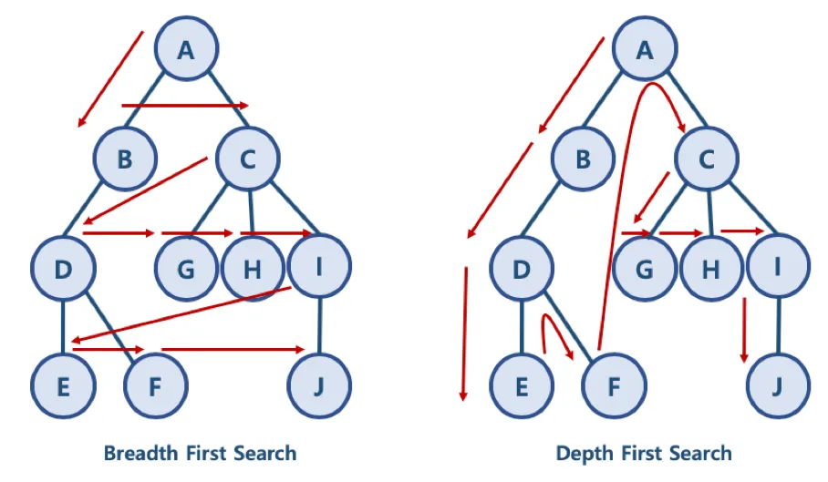

# 7장. 애플리케이션 테스트 관리

애플리케이션에 잠재되어 있는 결함을 찾아내는 일련의 행위 또는 절차

파레토 법칙 : 애플리케이션의 20%에 해당하는 코드에서 전체 결함의 80% 가 발견된다는 법칙

살충제 패러독스 : 동일한 테스트 케이스로 동일한 테스트를 반복하면 더 이상 결함이 발견되지 않는 현상

오류-부재의 궤변 : 소프트웨어의 결함을 모두 제거해도 사용자의 요구사항을 만족시키지 못하면 해당 소프트웨어는 품질이 높지 않다

### 애플리케이션 테스트의 분류

정적 테스트 : 프로그램을 실행하지 않고 명세서나 소스코드를 대상으로 분석

- 워크스루(전문가), 인스펙션(산출물 평가), 코드 검사

동적 테스트 : 프로그램을 실행하여 오류를 찾는 테스트

- 블랙박스, 화이트박스

테스트 기반

- 명세 기반 테스트: 요구 사항 명세를 다 테스트 케이스로
- 구조 기반 테스트: 내부의 논리 흐름에 따라 테스트 케이스 작성
- 경험 기반 테스트 : 유사 소프트웨어, 테스터의 경험 기반으로 수행

목적에 따른 테스트

- 회복 테스트 , 안전 테스트 , 강도 테스트 , 성능 테스트, 구조 테스트, 회귀 테스트, 병행 테스트

### 테스트 기법에 따른 애플리케이션 테스트

화이트박스 테스트 : 원시 코드의 논리적인 모든 경로를 테스트하여 테스트 케이스를 설계

종류 : 기초 경로 검사(절차적 설계의 논리적 복잡성 측정) , 제어 구조 검사(조건 검사, 루프 검사, 데이터 흐름 검사)

검증 기준

- 문장 검증 기준 : 모든 구문이 한 번 이상 수행
- 분기 검증 기준 : 모든 조건문에 대해 한번 이상 수행되도록
- 조건 검증 기준 : 조건문에 포함된 개별 조건식의 결과가 한번 이상 수행되도록
- 분기/조건 기준 : 분기 검증 기준과 조건 검증 기준을 모두 만족하는 설계

블랙박스 테스트(기능 테스트) : 각 기능이 완전히 작동되는 것을 입증하는 테스트

종류

- 동치 분할 검사 : 타당한 입력자료와 타당하지 않은 입력 자료의 개수를 균등하게 하여 테스트
- 경계값 분석 : 경계값에서 오류가 발생될 확률이 높다는 점 이용
- 원인-효과 그래프 검사 : 입력 데이터간의 관계와 출력에 영향을 미치는 상황을 체계적으로 분석
- 오류 예측 검사 : 경험, 감각으로 테스트
- 비교 검사 : 여러 버전의 프로그램에 동일한 자료 테스트

### 개발 단계에 따른 애플리케이션 테스트

v 모델

요구사항 → 분석 → 설계 → 구현 → 단위 테스트 → 통합 테스트 → 시스템 테스트 → 인수 테스트

단위 테스트 : 모듈 , 컴포넌트 테스트

통합 테스트 : 모듈들을 결합하여 하나의 시스템으로 완성시키는 과정 테스트

시스템 테스트 : 개발된 소프트웨어가 완벽하게 수행되는가 점검

인수 테스트 : 사용자의 요구사항을 충족하는지에 중점을 두고 테스트

- 알파 테스트 : 개발자의 장소에서 개발자 앞에서 행하는 테스트
- 베타 테스트 : 최종 사용자가 여러 명의 사용자 앞에서 행하는 테스트 기법

### 통합 테스트

모듈을 통합하는 과정에서 발생하는 오류 및 결함 테스트

하향식 통합 테스트 : 상위 모듈에서 하위 모듈 방향으로 통합하면서 테스트 하는 기법

- 스텁 : 주요 제어 모듈의 종속 모듈들
- 깊이 우선 통합법
- 넓이 우선 통합법

상향식 통합 테스트 : 하위 모듈에서 상위 모듈 방향으로 통합하면서 테스트

- 하위 모듈들을 클러스터로 결합한다.
- 상위 모듈에서 드라이버 작성

회귀 테스팅 : 통합 테스트로 인해 변경된 모듈이나 컴포넌트에 새로운 오류가 있는지 확인

### 테스트 케이스 / 테스트 시나리오 / 테스트 오라클

테스트 케이스 : 사용자의 요구사항을 정확하게 준수 했는지를 확인하기 위한 명세서

테스트 시나리오 : 테스트 케이스를 적용하는 순서에 따라 여러 개의 테스트 케이스를 묶은 집합

테스트 오라클 : 테스트 결과가 올바른지 판단하기 위해 사전에 정의된 참값을 대입하여 비교하는 기법

- 참 오라클 : 모든 테스트 케이스의 입력 값에 대해 기대하는 결과를 제공하는 오라클
- 샘플링 오라클 : 특정한 몇몇 테스트 입력 값들에 대해서만 결과를 제공
- 추정 오라클 : 특정 테스트 입력 값에 대해 기대하는 결과를 제공하고 나머지는 추정 처리
- 일관성 검사 오라클 : 변경이 있을 때 수행 전과 후의 결과 값이 동일한지 확인

### 애플리케이션 성능 분석

최소한의 자원을 사용하여 최대한 많은 기능을 신속하게 처리하는 정도

처리량 : 일정 시간 내에 처리하는 일의 양

응답 시간 : 요청 전달 → 응답 도착 까지의 시간

경과 시간 : 작업을 의뢰한 시간부터 처리가 완료될 때 까지 걸린 시간

자원 사용률 : 의뢰한 작업을 처리하는 동안의 CPU, 메모리, 네트워크 사용량

성능 테스트 도구

Jmeter , LoadUI, OpenSTA ,

모니터링 도구

Scouter , Zabbix

### 애플리케이션 성능 개선

최적화 : 나쁜 코드를 배제하고 클린 코드로 작성

스파게티 : 로직이 복잡하게 얽힌

외계인 : 참고문서 또는 개발자가 없어 유지보수가 어려운

클린 코드 원칙

- 가독성, 단순성, 의존성 배제, 중복성 최소화, 추상화

소스 코드 품질 분석 도구

- 정적 분석 도구 : 소스 코드를 실행 하지 않고 스타일, 결함을 확인
    - pmd, cppcheck, SonarQube, checkstyle, ccm, cobertuna
- 동적 분석 도구 : 소스 코드를 실행하여 코드에 존재하는 메모리 누수, 스레드 결함 분석
    - Avalanche, Valgrind